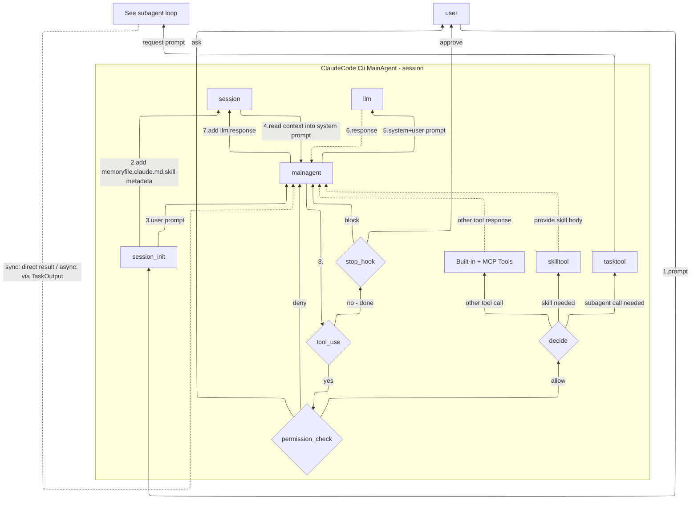
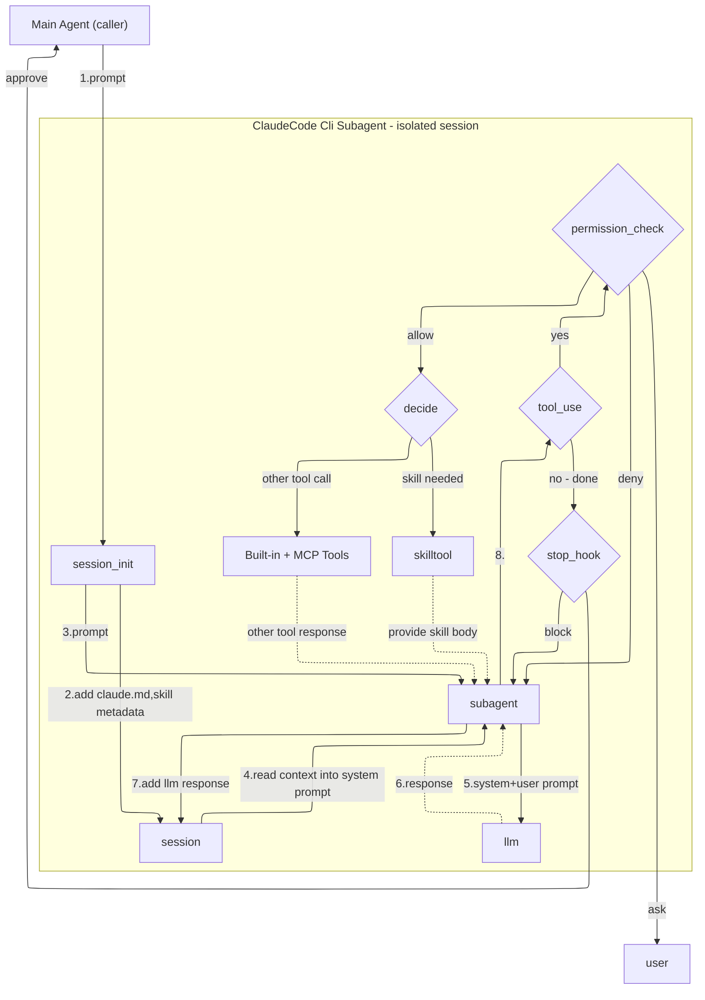

Most Claude Code users experience it as a conversation — type a prompt, get code back. But underneath that simple interaction is a **sophisticated agentic loop** that decides what to do, checks permissions, routes to the right handler, and loops until the task is complete.

Understanding this internal flow isn't just academic curiosity. It explains real behaviors you observe every day: why Claude asks for permission sometimes but not others, why subagents feel "isolated," why skills behave differently from regular tools, and why Claude sometimes self-corrects right before returning a response.

> **Disclaimer:** Claude Code is closed source. What follows is my **mental model** based on extensive use of Claude Code, its publicly available documentation, changelog, and my understanding of agentic frameworks like LangGraph. I am not claiming this is exactly how it works internally — but this model has consistently explained the behaviors I observe.

---

### What the Docs Tell You (and What They Don't)

Before diving into the internals, let's see what's already out there.

The official [How Claude Code works](https://code.claude.com/docs/en/how-claude-code-works) page describes the agentic loop as three blended phases: **gather context, take action, verify results**. It lists tool categories — file operations, search, execution, web, and code intelligence. It explains that Claude "chooses which tools to use based on your prompt."

All true. But **none of this explains the mechanics inside the loop.**

How does the agent decide whether it's done or needs to keep going? How are permissions checked — and what happens when they're denied? What's the architectural difference between a skill, a subagent, and a regular tool? Why do background subagents sometimes fail on permissions while foreground ones don't?

These are the questions this article answers.

*This article focuses on the flow mechanics — the how and why of the loop. For details on individual tools, hooks, permissions, and skills, the [official docs](https://code.claude.com/docs/en/overview) are the right place.*

---

### The Main Agent Loop

Here's the flow that executes every time you send a prompt to Claude Code:

Let's walk through it step by step.

**Step 1-2: Session Initialization.** When you start a session, `session_init` loads context into the session: your **memory files** (auto-memory from `MEMORY.md`), **CLAUDE.md** files (project instructions), and **skill metadata** (descriptions of available skills, not their full content). This is the foundation the agent works with.

**Step 3-4: Prompt Assembly.** Your user prompt is passed to the main agent, which reads the session context to assemble the full system prompt. This is why CLAUDE.md instructions and memory are available from the very first interaction.

**Step 5-6: LLM Call.** The assembled system + user prompt is sent to the Claude model. The model responds — possibly with text, possibly with tool_use blocks, possibly both.

**Step 7-8: Response Processing & tool_use Check.** The LLM response is added to the session. Then comes a critical gate: **does the response contain `tool_use` blocks?**

- **No tool_use** → The agent thinks it's done. Flow goes to the **stop hook**.
- **Yes tool_use** → Flow continues to **permission check**.

**Stop Hook.** This fires before the response is returned to the user. It can **approve** (let the response through) or **block** (force the agent to loop again). This is why Claude sometimes self-corrects at the very end of a task — the stop hook evaluated the response and decided it wasn't ready.

**Permission Check.** A three-way gate:
- **Allow** → Tool is permitted, flow continues to `decide`
- **Deny** → Tool is blocked, agent loops back (often tries a different approach)
- **Ask** → User is prompted for approval. If approved, flow continues to `decide`. If denied, the agent loops back just like an automatic deny.

**Decide.** After permission is granted, the agent routes to the correct handler:
- **Skill tool** → Returns the skill's full body content back to the agent (context injection, not execution)
- **Task tool** → Spawns an isolated subagent (see below)
- **Regular tools** → Executes built-in or MCP tools and returns the result

The tool response flows back to the main agent, and the loop continues until the LLM produces a response with no tool_use blocks.

---

### Key Architectural Insights

Four patterns in this flow that matter for power users:

**Permission check happens BEFORE routing.** All tools — skills, subagents, regular tools — go through the same permission pipeline before the `decide` step. This is why your permission rules in `.claude/settings.json` work uniformly. There's no special permission path for skills vs regular tools.

**Stop hook is a quality gate, not just a passthrough.** When the LLM produces a text-only response (no tool_use), it doesn't go directly to you. The stop hook evaluates first. If it blocks, the agent is forced to continue working. This explains the behavior where Claude appears to "change its mind" right at the end — it's the stop hook rejecting a premature completion.

**Skills are lazy-loaded context, not tools.** Skill *metadata* (short descriptions) is loaded at session start — this is how Claude knows what skills are available. But the full skill body is only injected when the skill is actually invoked via the skill tool. This is **progressive disclosure** — it keeps the context window lean until a skill is needed. When a skill fires, it doesn't "execute" — it returns its body content to the agent, enriching its context for the next LLM call.

**The `decide` routing is the orchestration layer.** This is what makes Claude Code more than a chat-with-tools. The agent distinguishes between three fundamentally different operations: **injecting knowledge** (skill), **delegating work** (subagent), and **taking action** (regular tool). Each has different implications for context, isolation, and control flow.

---

### The Subagent Loop

When the main agent needs to delegate work, the task tool spawns a **subagent** — an isolated session with its own agentic loop:

> **Note:** Background subagents collect permissions upfront before launch and auto-deny during execution.

The subagent loop looks similar to the main agent loop, but there are **critical differences**:

**No memory files.** Session init only loads `CLAUDE.md` and skill metadata — not memory files. The subagent gets project instructions but not your personal auto-memory.

**No nested subagents.** There is no `tasktool` in the subagent's toolset. A subagent cannot spawn its own subagents. This prevents unbounded recursion and keeps the execution model predictable.

**Returns to caller, not user.** When the subagent completes, the stop hook sends the result back to the **main agent** (not the user). The main agent then incorporates the result and continues its own loop.

**Foreground vs background permission behavior.** This is a nuance that trips people up:
- **Foreground subagents** pass permission prompts through to the user — the `ask → user` path works normally.
- **Background subagents** collect all needed permissions **upfront before launch**. During execution, any permission request that wasn't pre-approved is **auto-denied**. This is why background subagents sometimes fail on unexpected tool calls — they can only use tools that were anticipated and approved at launch time.

**Fresh context window.** Each subagent gets its own context, completely isolated from the main agent's conversation. This is a feature, not a limitation — it prevents long sessions from degrading subagent performance and keeps each subtask focused.

---

### Why Skills Are Cheap and Subagents Are Not (and When That's OK)

The Claude Code docs [compare skills and subagents](https://code.claude.com/docs/en/features-overview) on context cost — skills are "low" while subagents are "isolated from main session." But **why?** The architecture above makes it obvious.

**Look at the skill tool path in the main agent diagram.** When the `decide` node routes to `skilltool`, there's a single dotted arrow back: `provide skill body → mainagent`. That's it. No new session. No new LLM call. The skill body is injected into the **existing** agent's context, and the loop continues with the next LLM call now enriched with that knowledge. The cost is just the additional tokens of the skill body in the current context window.

**Now look at the subagent diagram.** When `decide` routes to `tasktool`, it triggers an **entirely new agentic loop** — `session_init → session → subagent → llm → tool_use → permission_check → decide → tools` — all running independently. Every iteration of that loop is a separate LLM call with its own context window. The subagent might make dozens of tool calls, each cycling through the full loop, before finally returning a summary to the main agent.

**This is the architectural reason subagents cost more.** It's not an implementation detail — it's a fundamental consequence of isolation. A skill enriches the current loop. A subagent spawns a new one.

**So when is the subagent cost justified?**

When the alternative is **worse**. If a task requires reading 30 files, running a test suite, or processing verbose logs, doing that inside the main agent's loop means all that output lands in the main context window — making every subsequent LLM call more expensive and potentially degrading quality. A subagent absorbs that cost in isolation and returns only a summary. The main agent's context stays lean.

Additionally, subagents can run on **cheaper models**. The built-in Explore subagent uses Haiku — fast and inexpensive for read-only exploration. Your main agent stays on Opus or Sonnet for reasoning-heavy work while Haiku handles the legwork. This is the kind of cost optimization that becomes obvious once you see the two separate loops in the architecture.

---

### Closing Thoughts

This is a **mental model**, not a specification. Claude Code is closed source and evolving fast — the internal architecture likely changes with every release. But having this model has consistently helped me explain and predict behaviors that would otherwise seem arbitrary.

When you understand the flow, things click into place: why `Shift+Tab` cycling through permission modes changes Claude's behavior, why your CLAUDE.md instructions take effect immediately, why skills feel different from regular tools, and why background subagents need their permissions figured out upfront.

> **Personal Insight:** My background with **LangGraph** — where you explicitly define nodes, edges, and conditional routing in agent graphs — made this mental model feel natural. Claude Code's internal flow maps closely to concepts like state graphs, conditional edges, and tool nodes. If you're familiar with any agentic framework, you already have the vocabulary to reason about what Claude Code is doing under the hood.

Use this understanding to work more effectively. Don't fight the architecture — work with it.

---

> [**Provide comments on LinkedIn**](https://www.linkedin.com/in/vikrantj/) (No extra login required!)

