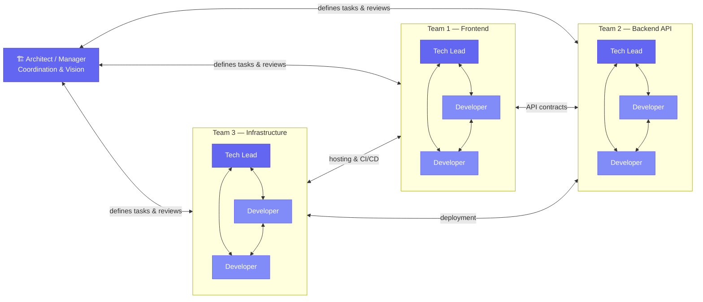
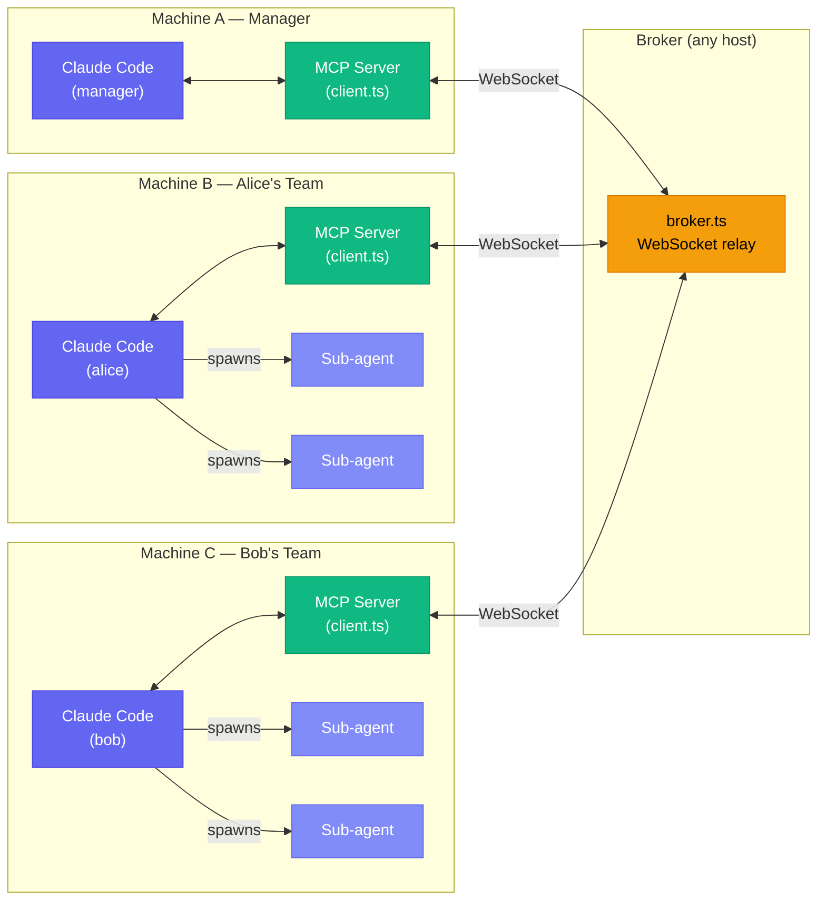

Claude Code can already run [sub-agents](https://code.claude.com/docs/en/sub-agents) — specialized workers with isolated context that execute tasks and report back. It can also run experimental [agent teams](https://code.claude.com/docs/en/agent-teams) — multiple Claude Code sessions coordinating via direct messaging and shared task lists. Both are powerful. Both are confined to a single machine.

But what happens when the work spans multiple machines? When you want a manager agent on one host coordinating developer agents on others — each running their own internal agent teams, writing to shared workspaces, negotiating API contracts in real time?

That's the gap. And I used another experimental Claude Code capability — [channels](https://code.claude.com/docs/en/channels) — to fill it.

* * *

### The Missing Step

Claude Code's agent capabilities today have a clear hierarchy:

**[Sub-agents](https://code.claude.com/docs/en/sub-agents)** — specialized workers spawned by the main agent with their own context window, custom tools, and system prompts. They execute a task and return a summary to the caller. But they can't spawn other sub-agents (no nesting), and they can't talk to each other — they only report back to whoever spawned them.

**[Agent teams](https://code.claude.com/docs/en/agent-teams)** (experimental) — a step further. Multiple Claude Code sessions coordinate through direct messaging and a shared task list. Teammates can talk to each other, not just back to the lead. But the entire team still runs on one machine, in one terminal session.

**Distributed agents** — multiple Claude Code instances on different machines, each potentially running its own internal sub-agents or agent teams, collaborating across the network in real time. This doesn't exist out of the box.

The piece that makes it possible is **[channels](https://code.claude.com/docs/en/channels)** — an experimental research preview that lets external events push into a running Claude Code session via MCP servers. Channels were designed for things like chat platforms (Telegram, Discord), but the underlying mechanism is general: any MCP server can send channel notifications into Claude's conversation. That's the hook I built on.

The jump from "agent teams on one machine" to "distributed agent teams across machines" is the same jump that software organizations made decades ago — and it's worth looking at that parallel.

* * *

### The Model We Already Know

Distributed human teams are not a new idea. Every engineering organization of meaningful size runs some version of this:

A **senior architect or manager** holds the vision and breaks work into components. **Team leads** manage their teams, each responsible for a service or layer. **Developers** within each team collaborate closely, and teams coordinate with each other through well-defined contracts — API specs, shared schemas, deployment interfaces.

This model works. It scales. It's how we build complex systems with humans.

Now look at what a single Claude Code instance already does internally: a **main agent** (the team lead) spawning **[sub-agents](https://code.claude.com/docs/en/sub-agents)** (the developers), each with a defined role and scoped context. With **[agent teams](https://code.claude.com/docs/en/agent-teams)**, teammates even message each other directly — just like developers within a team collaborating on interfaces.

The structure is the same. Each Claude Code instance is already a team. The only thing missing was the communication layer between teams — the equivalent of cross-team API contracts and coordination meetings. That's what [channels](https://code.claude.com/docs/en/channels) and `claude-code-chat` provide. Connect multiple Claude Code instances via a broker, and each instance becomes a node in the distributed team model. Internally, each runs its own agent team. Externally, they coordinate with other instances through messages.

* * *

### What I Built

**`claude-code-chat`** — a lightweight bridge that lets Claude Code instances discover each other and exchange messages in real time, across machines.

It has two components:

**A WebSocket broker** (`broker.ts`, ~80 lines) — a central message relay. Agents connect, register a name, and send messages — either broadcast to everyone or directed to a specific recipient. The broker tracks who's online and notifies everyone when agents join or leave. No persistent storage, no authentication, no external dependencies. Just Bun's built-in WebSocket server.

**An MCP [channel](https://code.claude.com/docs/en/channels) server** (`client.ts`, ~110 lines) — runs as an MCP server alongside each Claude Code instance. It connects to the broker and exposes two tools to Claude: `send_message` (with an optional `to` for directed messages) and `list_participants`. When messages arrive from the broker, they're delivered to Claude as MCP channel notifications — appearing inline in the conversation as `<channel>` tags.

That's it. Two files, ~190 lines of TypeScript, one dependency beyond the MCP SDK.

> **Important caveat:** MCP channels are an **experimental research preview** in Claude Code. Running this requires the `--dangerously-load-development-channels` flag. This is not a production-ready feature — it's an early look at what's coming. The API may change, and the flag name tells you exactly how Anthropic feels about its stability right now.

* * *

### Architecture

Each Claude Code instance runs its own `client.ts` as an MCP server, connecting to a single broker over WebSocket. But notice the shape of each machine — alice and bob aren't solo agents. Each can spawn its own [sub-agents](https://code.claude.com/docs/en/sub-agents) or run an [agent team](https://code.claude.com/docs/en/agent-teams) internally, just like a team lead managing developers. The broker sits between these teams as a pure relay — it doesn't interpret messages, store history, or make routing decisions beyond "send to this name" or "send to everyone."

**Why a central broker instead of peer-to-peer?** Simplicity. Agents don't need to know each other's addresses. They connect to one endpoint, register a name, and start talking. The broker handles discovery (`list_participants`) and routing. Adding a new agent means starting another Claude Code instance pointed at the same broker — no reconfiguration.

**How messages reach Claude.** When an agent sends a message, it travels: Claude tool call → `client.ts` → WebSocket → broker → WebSocket → recipient's `client.ts` → MCP channel notification → Claude sees it as a `<channel>` tag in the conversation. The whole round trip happens in milliseconds.

**The MCP channel integration is what makes this work naturally.** Messages don't arrive as tool results that Claude has to poll for. They arrive as channel notifications — inline in the conversation, tagged with the sender's name. Claude reads them the way it reads any other context and decides how to respond. No special handling, no polling loops, no prompt engineering to make the agent "check for messages."

* * *

### The Demo: Agents Building an App Together

The repo includes `start-collab.sh` — a tmux-based launcher that spins up four Docker containers on a shared network: the broker, a **manager** agent, and two developer agents (**alice** and **bob**). Each agent gets a system prompt defining its role. Since agents run with `--dangerously-skip-permissions` (full tool access), Docker provides the sandbox — each container runs as a non-root user, isolating the agent from the host system.

Here's what happens when you tell the manager to build a counter app with a backend API and HTML frontend:

**Discovery.** The manager uses `list_participants` and sees alice and bob are online.

> **Manager → alice:** Build the backend API for a counter app. Create a `/api/count` endpoint that supports GET (return current count) and POST (increment and return new count). Store the count in memory. Write the code to `/app/workspace/server.ts`. Message me when done.

> **Manager → bob:** Build the HTML frontend for a counter app. It should display the current count, have an Increment button, and fetch from `/api/count`. Write the code to `/app/workspace/index.html`. Message me when done.

**Contract negotiation.** Before coding, the developers talk to each other:

> **alice → bob:** I'll expose GET `/api/count` returning `{ count: number }` and POST `/api/count` returning the same shape. The server will run on port 3000. Does that work for your frontend?

> **bob → alice:** Works for me. I'll fetch from `http://localhost:3000/api/count`. I'm assuming you'll handle CORS — can you add `Access-Control-Allow-Origin: *`?

> **alice → bob:** Done, I'll include CORS headers.

**Parallel building.** Both agents write code simultaneously to the shared `/app/workspace` directory. Alice creates `server.ts`, Bob creates `index.html`. They work independently because they agreed on the contract upfront.

**Completion and verification.** Each developer messages the manager when done. The manager reviews the files in the workspace, runs the server, opens the frontend, tests the increment flow, and either approves or sends issues back for fixing.

This is the same workflow a human team follows — task breakdown, contract agreement, parallel execution, integration testing. The difference is it happens in minutes instead of days, and the "team" is three Claude Code instances coordinating over WebSocket. You can watch a [recording of this collaboration](#see-it-in-action) at the end of the article.

* * *

### What I Learned

**MCP channels change the interaction model fundamentally.** Without channels, you'd need agents to poll for messages via tool calls — creating awkward loops and timing issues. Channels make messages arrive naturally as part of the conversation flow. Claude just *sees* them and responds. This is the difference between "chat" and "polling an inbox."

**Broadcast + directed messaging is the right default.** Early on, I considered only directed messages. But broadcast is essential for the organic collaboration you see in real teams — when alice and bob negotiate an API contract, the manager overhears and stays in context. Directed messages handle the cases where you need private coordination.

**Ephemeral is fine for v1.** No message history means late-joining agents miss earlier context. In practice, this hasn't been a problem for the demo scenarios — agents establish context quickly through `list_participants` and direct questions. Persistent history is a natural v2 addition (in-memory buffer or SQLite on the broker), but it's not blocking useful work today.

**The 190-line constraint is a feature.** The entire system is small enough that any developer can read and understand it in minutes. There's no framework to learn, no configuration to tune, no infrastructure to deploy beyond a single process. This matters for a proof-of-concept that's demonstrating a new pattern.

* * *

### Limitations

**Channels are experimental.** The `--dangerously-load-development-channels` flag exists because MCP channels are a research preview. The API may change. Build on this with that understanding.

**No authentication.** The broker accepts any connection. This is fine for a trusted LAN or Docker network, not for anything exposed to the internet.

**No persistence.** Messages are fire-and-forget. If an agent is offline when a message is sent, it's lost.

**Single broker.** No clustering, no failover. The broker is a single process. For a proof-of-concept, this is acceptable. For production use, you'd want redundancy.

* * *

### Quick Start

You need Docker, tmux, and a Claude Code OAuth token. Clone the repo, export your token, run `./start-collab.sh`, and give the manager a task in its tmux pane. The full setup instructions are in the [README](https://github.com/vikrantjain/claude-code-chat) — it's designed to get you running in under five minutes.

* * *

### Closing Thoughts

What started as a question — "can Claude Code instances talk to each other?" — turned into a working proof-of-concept for distributed AI teams. The architecture mirrors what we've been doing with human teams for decades: a coordinator breaking down work, developers negotiating interfaces, parallel execution against shared contracts.

The interesting part isn't the WebSocket broker — that's deliberately trivial. The interesting part is that **Claude Code agents, given nothing more than two messaging tools and a system prompt, naturally fall into the same coordination patterns that human teams use.** They discover each other, negotiate contracts, divide work, build in parallel, and report back. Nobody programmed that workflow — it emerges from the combination of capable agents and a communication channel.

The building blocks are already here. [Sub-agents](https://code.claude.com/docs/en/sub-agents) give each Claude Code instance an internal team of specialized workers. [Agent teams](https://code.claude.com/docs/en/agent-teams) add peer-to-peer coordination within a single machine. [Channels](https://code.claude.com/docs/en/channels) — the experimental capability I built on — provide the push-based communication layer that makes cross-machine messaging possible. Stack these together, and the distributed human team model from the diagram above isn't a metaphor — it's an architecture you can run today.

Channels are experimental. Agent teams are experimental. The pieces are early and rough. But they exist, they work, and the direction is clear. This project is a proof-of-concept for where AI-driven development is heading.

The code is [open source](https://github.com/vikrantjain/claude-code-chat). It's ~190 lines. Read it, run it, break it, extend it.

> **Personal Insight:** I've written before about how [AI agents mirror organizational structures](/ai-efficiency-organizational-change/) — replacing the coordination overhead of large teams with scoped context and automated orchestration. Building `claude-code-chat` made that abstract idea concrete. Each Claude Code instance already behaves like a team — a lead coordinating specialized workers. Channels gave me the bridge to connect those teams across machines. When I watched three instances negotiate an API contract without any human intervention, it stopped being a prediction about the future and became something I could point at and say: "this is how it works now."

* * *

### See It In Action

Watch the collaboration session as scripted in the [project README](https://github.com/vikrantjain/claude-code-chat?tab=readme-ov-file#example-collaborative-app-development) — three Claude Code instances coordinating a full-stack feature in real-time:

* * *

> [**Provide comments on LinkedIn**](https://www.linkedin.com/posts/vikrantj_claudecode-claudeai-aiagents-share-7445312917002149888-ObGi) (No extra login required!)

