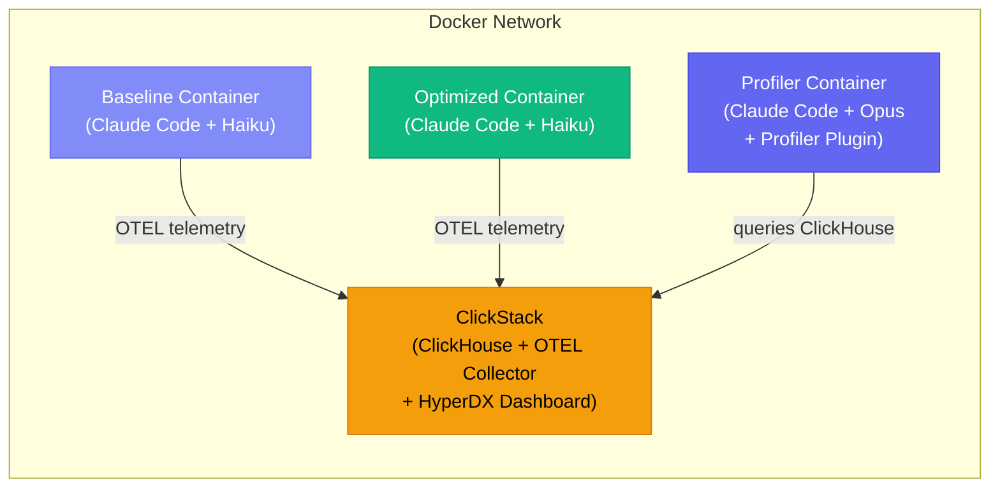
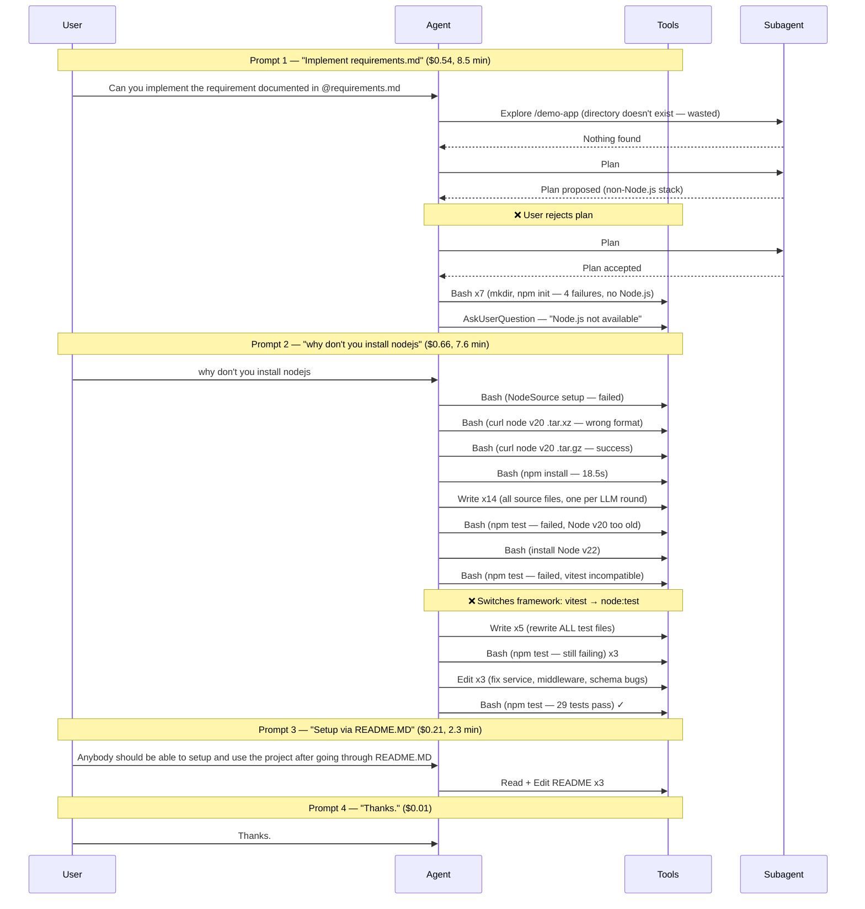

I gave Claude Code a simple task: build a REST API for managing tasks. Title, description, due date, priority, category — standard CRUD. The kind of thing a capable model should handle in one shot.

Instead, I watched it spend **$1.42 and nearly 19 minutes** thrashing through 103 tool calls — trying `npm` before Node.js was installed, asking me for help, attempting `apt-get` without root access, downloading the wrong Node.js version, writing all tests in vitest then rewriting them in node:test, and cycling through 33 tool calls just to get tests passing. I had to intervene twice to keep it on track.

Then I profiled that session. I could see exactly where every dollar went: **46% of the total cost ($0.66) was triggered by a single user correction** — "why don't you install nodejs." That one prompt cascaded into 66 LLM calls covering environment setup, code generation, test framework migration, and debugging — all in one massive interaction where context grew from 49K to 97K tokens.

Armed with that data, I applied three targeted fixes. The next run of the **same task, same model, clean directory**: **$0.58, 6.6 minutes, 44 tool calls, zero user intervention.**


This isn't about switching to a better model. Both runs used Claude Haiku (the profiler itself ran on Opus). Even with well-written prompts and good project context, there is always room to optimize — especially when working with costly models or doing repetitive, similar tasks.

Profiling builds your understanding of how agents actually work from the inside, and that understanding compounds. Iterative build tools can get you to a working system, but they burn tokens getting there. Profiling shows you **where** those tokens go, so you can engineer the waste out before scaling up.

---

### The Observability Gap

When you use an AI coding agent, you see two things: the prompt you typed and the output you got back. Between those two points, the agent might have made 107 API requests, spawned 3 subagents, failed 16 Bash commands, switched test frameworks mid-stream, and burned through millions of tokens — and you'd never know unless you were watching the terminal scroll by.

This is the observability gap. In traditional software, we solved this decades ago with APM tools, distributed tracing, and structured logging. We don't ship services without Datadog or Grafana dashboards telling us where latency lives and where errors cluster.

AI coding agents have no equivalent. You get a cost number at the end of the session and a vague sense of whether it went well. If the session was expensive, you don't know *why*. If the agent struggled, you can't see *where*. And critically, you can't systematically improve the next run because you have **no data to act on**.

That's what I set out to fix.

---

### The Setup: Telemetry for Claude Code

Claude Code supports **OpenTelemetry** — the same observability standard used across the software industry. When enabled, it exports traces, metrics, and logs covering every aspect of a session: API requests, tool calls (with command details and file paths), token usage by type, cost, duration, user prompts, and permission decisions.

The core requirement is a **ClickHouse database** — the same database [Anthropic uses internally](https://clickhouse.com/blog/how-anthropic-is-using-clickhouse-to-scale-observability-for-ai-era) for their own Claude observability — with any OTEL-compatible collector that can write to it. The profiler queries ClickHouse directly. For this setup, I used **ClickStack** (ClickHouse + OTEL collector + HyperDX dashboard bundled together) for ease of setup, and ran everything in Docker containers to ensure clean, reproducible environments:



**Baseline and Optimized containers** each run Claude Code with Haiku and export OTEL telemetry to ClickStack. **The Profiler container** runs Claude Code with Opus and the profiler plugin; instead of exporting telemetry, it queries ClickHouse directly to analyze the baseline session and produce optimization artifacts. Each container mounts a shared `demo/` directory that carries configuration files forward across phases — but application code is ephemeral, so each run builds from scratch.

The key environment variables that unlock detailed telemetry:

```
CLAUDE_CODE_ENABLE_TELEMETRY=1
OTEL_LOG_TOOL_DETAILS=1
OTEL_LOG_USER_PROMPTS=1
CLAUDE_CODE_ENHANCED_TELEMETRY_BETA=1
```

With these enabled, every tool call, every prompt, every permission decision, and every token is captured in queryable ClickHouse tables: `otel_traces`, `otel_logs`, and `otel_metrics_sum`.

> **Note:** All tools used in this setup (monitoring stack, profiler plugin, container image) are linked at the end of this article.

---

### The Baseline: Watching an Agent Struggle

The baseline prompt pointed to a `requirements.md` file that was deliberately lean — requirements only, no tech stack, no environment hints:

> Build a task manager REST API in the /demo-app/ directory. It should support creating, reading, updating, and deleting tasks. Each task should have a title, description, due date, priority level, and category. Include a test suite and verify all features work by running the tests.

Here's what the agent actually did, reconstructed from telemetry and the session recording:

| Phase | What Happened | Tool Calls | Waste |
|-------|--------------|------------|-------|
| 1. Discovery & planning | 3 subagents, 2 planning cycles | 14 | Explored a non-existent directory, rejected first plan |
| 2. Environment setup | Node.js installation trial-and-error | 14 | `apt-get` without root, wrong Node version, asked user for help |
| 3. Code generation | 16 files written one at a time | 20 | Each file = separate LLM round, ~840K redundant cache reads |
| 4. Test-fix cycle | Framework switch, debug spiral | 33 | Rewrote all 5 test files after choosing wrong framework |
| 5. Verification & polish | README, curl tests, cleanup | 22 | Required a third user prompt to add README |

**Phase 1 — Discovery and planning false starts.** The agent spawned 3 subagents sequentially: one to explore the directory (which didn't exist yet — wasted), and two Plan subagents because the first plan proposed a non-Node.js stack, which I rejected. Two full planning cycles before a single line of code was written.

**Phase 2 — The environment struggle.** This was the most expensive phase. The agent tried `npm init` — failed, no Node.js. Tried `python3` — not found. Asked me what to do via `AskUserQuestion`. I said "why don't you install nodejs." It tried `apt-get install nodejs` — permission denied (not root). Tried the NodeSource setup script — failed. Downloaded Node.js v20 as a tarball — wrong version. Downloaded v22 — finally worked. **14 Bash calls just to get a runtime installed.**

**Phase 3 — Code generation.** Created 16 source files one at a time — db.js, config, schemas, middleware, services, controllers, routes, app.js, server.js, plus 5 test files and a helper. Each file was a separate Write call, each requiring its own LLM round. The profiler later calculated this pattern caused ~840K tokens of redundant cache reads.

**Phase 4 — The test-fix death spiral.** Ran tests — failures. Node v20 didn't support the test syntax. Switched to v22. Still failed. Reinstalled node_modules. Switched from vitest to Node's built-in test runner. Rewrote all 5 test files. Still had failures. Edited service code, middleware, and schemas. Ran the server manually with curl to debug. Wrote a standalone Zod test script to isolate a validation issue. Eventually reached **29 tests passing** after **33 tool calls** in this cycle alone.

**Phase 5 — Verification and polish.** A third user prompt was needed — "Anybody should be able to setup and use the project after going through README.MD" — because the agent hadn't created one. More tool calls, more time, more cost.

The final tally: **$1.42, 103 tool calls, 107 API requests, 4 user prompts (2 of them corrective interventions).**

---

### The Profiler: Cracking Open the Black Box

This is where the observability payoff kicks in. I ran the [claude-session-profiler](https://github.com/vikrantjain/claude-session-profiler) plugin — it connected to ClickHouse, queried the baseline session's telemetry, and produced a detailed analysis.

One of the most revealing outputs was the **session flow diagram** — reconstructed entirely from OTEL traces, not from source code or documentation. This is the agent's real internal behavior as observed through telemetry:



**You don't need to read source code to understand how an AI agent works internally.** Point the profiler at **any session** and get a diagram like this — the agent's real execution flow for your specific task. This one shows three subagents spawned sequentially, a rejected plan, 14 files written one at a time, a full test framework migration mid-stream, and a debug spiral — all triggered by a five-word user correction.

The profiler's per-prompt cost breakdown quantifies the damage:

| # | Prompt | LLM Calls | Tool Calls | Cost | Time |
|---|--------|-----------|------------|------|------|
| 1 | "Can you implement the requirement documented in @requirements.md" | 25 | 22 | $0.54 | 8.5 min |
| 2 | "why don't you install nodejs" | 66 | 65 | $0.66 | 7.6 min |
| 3 | "Anybody should be able to setup and use the project after going through README.MD" | 15 | 14 | $0.21 | 2.3 min |
| 4 | "Thanks." | 1 | 0 | $0.01 | 0.03 min |

**Prompt 2 — a five-word user correction — consumed 46% of the entire session cost.** It triggered 66 LLM calls because the agent interpreted it as a green light to do *everything*: install Node.js, write all code, set up tests, debug failures, and verify — all within a single interaction where context grew from 49K to 97K tokens.

Beyond the per-prompt breakdown, the profiler surfaced specific patterns:

**33% Bash failure rate.** 16 out of 48 Bash calls failed — 6 from environment probing (trying commands that didn't exist), 2 from wrong Node.js archive format, 6 from test runner failures, 2 miscellaneous. Each failure added error output to context and triggered at least one additional LLM call to diagnose and retry.

**2.7 minutes of permission wait time.** The user approved 47 out of 48 Bash calls (one was auto-allowed). At ~3.4 seconds average per approval, that's 2.7 minutes of a human clicking "Yes" repeatedly for commands that were always going to be approved.

**The vitest-to-node:test rewrite.** The agent chose vitest as the test framework, then discovered it didn't work in the container environment. It uninstalled vitest and rewrote all 5 test files using node:test — approximately 12 LLM rounds and ~10K output tokens of completely duplicated work.

---

### Three Targeted Fixes

The profiler didn't just identify problems — it produced three artifacts that encode the fixes directly into the project. Each targets a specific waste pattern: permission delays, environment and tech stack guessing, and prompt ambiguity.

**1. Permission allow rules** (`settings.local.json`)

```json
{
  "permissions": {
    "allow": [
      "Bash(npm *)", "Bash(node *)", "Bash(curl:*)",
      "Bash(mkdir *)", "Bash(ls *)", "Bash(find *)",
      "Bash(cat *)", "Bash(export PATH=*)"
    ]
  }
}
```

Auto-approves standard development commands. Eliminates ~2.7 minutes of permission prompts per session.

**2. CLAUDE.md project context** (22 lines)

```markdown
# Project: demo-app (Task Manager REST API)

## Environment
- Node.js is NOT pre-installed. Download a binary release from
  https://nodejs.org (linux-x64 .tar.gz) to /home/claude/, extract it,
  and add its bin/ directory to PATH before running any node/npm commands.
- No apt-get/sudo access. Do not attempt package manager installs.

## Tech Stack
- Runtime: Node.js (v22+)
- Framework: Express
- Database: better-sqlite3 (SQLite)
- Validation: Zod
- Test runner: Node built-in (node:test + node:assert)
  -- do NOT use vitest, jest, or mocha

## Workflow Guidance
- For greenfield projects, skip Explore subagents
- Batch multiple file writes into a single LLM response
```

Three lessons encoded: (a) how to install Node.js without probing failures, (b) which tech stack to use without guessing, (c) workflow patterns to avoid the one-file-per-call overhead.

**3. Refined requirements.md** (from 1 line to structured)

Before:
> Build a task manager REST API in the /demo-app/ directory. It should support creating, reading, updating, and deleting tasks. Each task should have a title, description, due date, priority level, and category. Include a test suite and verify all features work by running the tests.

After:
```markdown
Build a task manager REST API in the /demo-app/ directory.

## Requirements
- CRUD operations for tasks
- Each task has: title, description, due date, priority level, and category
- Include a test suite and verify all features pass

## Implementation
- Node.js (v22+) with Express, better-sqlite3, and Zod for validation
- Use Node's built-in test runner (node:test + node:assert) with supertest
- Node.js is NOT pre-installed -- download the linux-x64 binary from
  nodejs.org to /home/claude/ and add to PATH
- Create a README.md with setup instructions
```

Every ambiguity that caused thrashing in the baseline is now resolved upfront. The profiler predicted this combination would cut cost roughly in half (~$0.65-0.75) and finish in 8-10 minutes.

---

### The Optimized Run: Same Task, Same Model, Different Result

Clean directory — no pre-existing code. Same model. Same prompt structure. The only differences: the three artifacts above.

The contrast was immediate. **One planning cycle** instead of two — CLAUDE.md told it to skip Explore for greenfield projects. **Node.js installed in one download** — though the model chose v24.14.1 instead of the recommended v22, it knew to use a tarball and had the PATH instructions ready. No `apt-get` attempts, no `AskUserQuestion`, no user intervention.

Code generation was leaner: **8 source files** with a flatter architecture (validators, routes, db, app, server, tests, README) versus the baseline's 16 files with separate config, schemas, middleware, services, and controllers layers.

The one surprise: `npm install` failed because **better-sqlite3 had no prebuilt binary for Node v24.14.1**, and the container lacked compilation tools (no node-gyp, python3, make, or g++). The agent recognized the root cause in one attempt, pivoted to **sql.js** (a pure JavaScript/WASM SQLite implementation requiring zero native dependencies), created a `db-wrapper.js` abstraction layer, adapted 5 files, and had all **26 tests passing**. The entire test-fix cycle took 15 tool calls — compared to the baseline's 33.

This is worth noting: the profiler recommended better-sqlite3 based on what the baseline used, but the model's choice of a newer Node.js version created an incompatibility the profiler couldn't have predicted. The model handled this gracefully — it diagnosed the failure, chose a pragmatic alternative, and adapted in one focused pass rather than thrashing.

Final output: "I've successfully implemented the Task Manager REST API." Server boots cleanly. All tests pass. README with setup instructions included. **Zero user intervention.**

---

### The Numbers

| Metric | Baseline | Optimized | Change |
|--------|----------|-----------|--------|
| **Total Cost** | $1.42 | $0.58 | **-59%** |
| **Duration** | 18.6 min | 6.6 min | **-64%** |
| **Active Time** | 737s | 287s | **-61%** |
| **Tool Calls** | 103 | 44 | **-57%** |
| **API Requests** | 107 | 45 | **-58%** |
| **Output Tokens** | 54,068 | 28,069 | **-48%** |
| **User Prompts** | 4 | 2 | **-50%** |
| **User Interventions** | 2 | 0 | **-100%** |

The profiler predicted ~$0.65-0.75 cost and 8-10 minutes. Actual: $0.58 and 6.6 minutes. The cost prediction was within range; the time prediction was conservative. This **validates the telemetry-based analysis as a useful forecasting tool**, not just a post-hoc report.

The tool usage shift tells the structural story:

| Tool | Baseline | Optimized |
|------|----------|-----------|
| Bash | 48 | 19 |
| Write | 28 | 10 |
| Edit | 11 | 10 |
| Read | 8 | 2 |
| Agent (subagents) | 3 | 1 |
| AskUserQuestion | 1 | 0 |

Fewer Bash calls because the agent wasn't probing a mystery environment. Fewer Writes because it created 8 files instead of 16. Fewer subagents because it didn't need to re-plan. Zero user questions because CLAUDE.md answered them before they were asked.

---

### What This Means in Practice

The 60% cost reduction on a $1.42 Haiku session saves $0.84. That's not going to change anyone's budget. But the pattern scales — the waste patterns the profiler found (environment probing, framework guessing, one-file-per-call overhead) aren't specific to this task. They're the agent's default behavior when it lacks context, and they repeat across every session until you fix them. A well-crafted CLAUDE.md eliminates entire categories of waste on every subsequent run.

More importantly, the profiling reveals **structural inefficiencies that compound with model capability and task complexity.** A 33% Bash failure rate on a simple CRUD task means the same failure rate on a multi-service migration — but with 10x more tool calls, the cost of each wasted retry multiplies. The patterns are the same; the stakes are not.

The profiler's real value isn't the cost number. It's the **visibility**. When you can see that 46% of your cost came from a single corrective prompt, or that 33% of Bash calls failed, or that the agent rewrote all test files because it guessed the wrong framework — you know exactly what to fix. Without that data, you're **optimizing blind**.

---

### Closing Thoughts

AI coding agents are powerful, but they're opaque by default. You interact with a prompt-and-response interface while the agent makes hundreds of internal decisions — tool choices, error recovery strategies, architecture patterns, technology selections — that you never see and can't influence until something goes wrong.

Telemetry changes that dynamic. With OTEL tracing, every tool call, every token, every permission decision, and every failure is captured and queryable. The [profiler plugin](https://github.com/vikrantjain/claude-session-profiler) turns that raw data into actionable artifacts — CLAUDE.md guidance, permission rules, refined prompts — that encode lessons learned into the project itself.

This is the same shift that happened in backend engineering when we went from "check the logs" to structured observability. Once you can see what's happening inside the system, you stop guessing and start engineering.

> **Personal Insight:** Building the [monitoring stack](https://github.com/vikrantjain/claude-code-monitoring) and [profiler plugin](https://github.com/vikrantjain/claude-session-profiler) started as curiosity — I wanted to understand what Claude Code was actually doing during those long sessions where the terminal scrolled faster than I could read.
>
> The biggest surprise wasn't the waste itself — it was *how predictable* it is. The same failure modes show up in nearly every session I've profiled since: probing for tools that aren't installed, guessing tech choices that could have been specified, writing files one at a time when they could be batched. Once you see that, CLAUDE.md stops being a nice-to-have and becomes the single highest-leverage artifact in your project.

The tools referenced in this article:
- **[claude-code-monitoring](https://github.com/vikrantjain/claude-code-monitoring)** — ClickStack docker-compose + HyperDX dashboard for Claude Code telemetry
- **[claude-session-profiler](https://github.com/vikrantjain/claude-session-profiler)** — Claude Code plugin that analyzes session telemetry and produces optimization artifacts
- **[claude-code-container](https://github.com/vikrantjain/claude-code-container)** — Docker container for running Claude Code in isolated, reproducible environments

---

> [**Discuss on LinkedIn**](https://www.linkedin.com/posts/vikrantj_claudecode-claudeai-aiagents-share-7450385234539253760-lecH?utm_source=share&utm_medium=member_desktop&rcm=ACoAAAE5wE0BOQMw8zJ20QN54UvpVrw33kmUWjE) (No extra login required!)

> **Provide comments here** if you're a fellow Hashnode creator.
