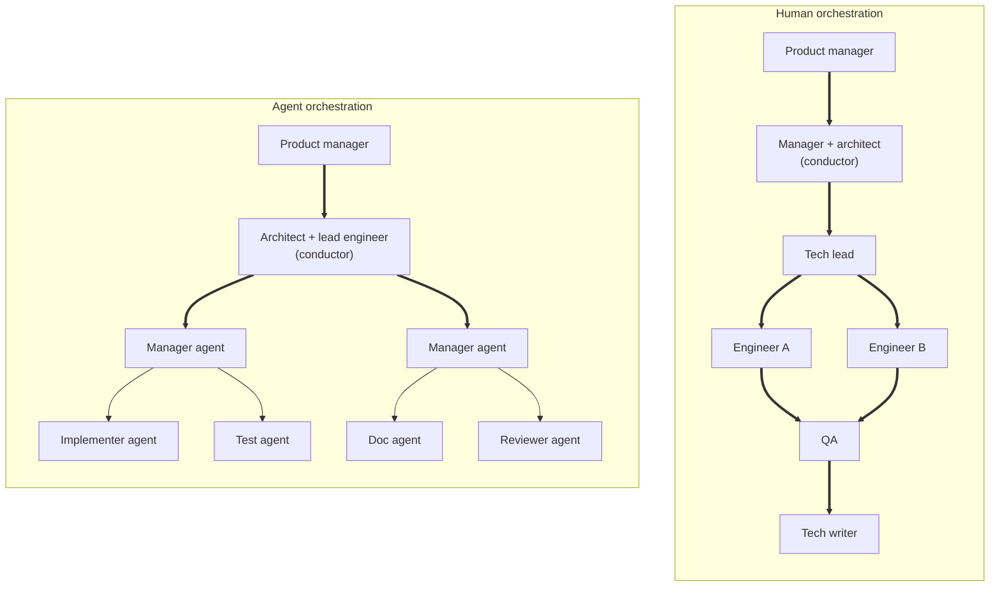

Your organization just spent six figures putting an AI coding tool on every developer's laptop, expecting 3–5x faster delivery — and some pitches went as high as 10x. A year in, you're shipping slower, paying more, and your bug count hasn't moved. So you're shopping for a different AI tool — convinced the last one was wrong.

**The tool isn't the variable. The category is.**

---

> I argued [previously](https://vikrantjain.hashnode.dev/ai-efficiency-organizational-change) that AI productivity gains require organizational change, not just tool adoption. Several leaders pushed back: *you're proposing a solution without showing me the real problem.* That's fair. This article shows both — first the problem, then the solution.

### The failure loop

I've watched this loop play out. An engineering organization rolls out costly AI licenses to every developer and keeps its existing process — product writes specs, architects design, work breaks down into sprint tickets, tickets get assigned to humans. Then it expects the AI to make those humans 3–5x faster inside that same machine.

A year later, deliveries are slower, total cost is higher, and bug counts are flat or worse. The leadership response is rarely to question the process. It's to switch to a different AI tool. Six months later, same result.

They keep solving for the wrong variable.

---

### A coding agent is not an IDE

The category mistake is hiding in the procurement spec. An IDE is an *integrated* development environment — editor, file tree, terminal, debugger, search — wrapped together for human eyes and hands. The "I" stands for integration, and integration is for *humans*.

A coding agent doesn't have eyes. It calls discrete tools — read a file, run a command, edit a line — and reads back the response. It doesn't need an integrated workspace because it doesn't *perceive* a workspace; it perceives tool outputs in sequence. The IDE is what *you* use to watch the agent and steer it. **For the agent, the IDE is a dashboard, not a workshop.**

This sounds pedantic until you notice that almost every AI agent rollout in 2025–26 has been priced, distributed, and measured as if the agent were a smarter IDE. Per seat. Per developer. Per hour saved on autocomplete. That framing caps the gains at autocomplete-grade numbers — single-digit percentages on individual coding tasks. The 3–5x leaders were promised lives nowhere near that ceiling, because reaching it requires using the agent for what it actually is.

And the per-seat framing has a second cost that gets worse at scale. Each developer hands the agent only their own slice — the ticket they got assigned, the function they're editing, the bug they're chasing. The agent never sees the full system or the goal the organization is trying to reach. **It works for the individual user, not for the system the organization is building.** Bigger team, smaller per-developer slice, narrower agent view. Compute gets wasted rebuilding partial context, over and over. Implementations contradict each other across teams. Errors the agent could have caught with broader visibility slip through. The fix isn't a better per-seat tool — it's changing what the agent is being asked to be.

---

### What the agent actually is

A coding agent takes on *roles* in the development process. Not slots — roles. Analyst, architect, implementer, reviewer, tester. Properly directed, one agent — or a coordinated set of them — can carry whole pieces of work from intent to merged code. **The unit of agent value is the role, not the keystroke.**

This is why "license per developer" misses. You're not equipping a developer with a faster keyboard. You're putting a whole team's worth of capacity — junior, mid, and senior — inside a tool, and then asking your existing process to make use of it.

Which brings us to the actual problem.

---

### Your organization is already an orchestration system

Modern engineering organizations are orchestration machines. Sprints, story points, work-breakdown structures, ticket assignment, standups, code-review queues, performance reviews — every one of these is scaffolding designed to coordinate, dispatch, and measure *human* labor. The humans are the orchestrated; managers and processes are the orchestrators.

When you drop an agent into this machine, you put it into a *human-shaped slot*: ticket-assigned, sprint-committed, standup-reported, reviewed at human cadence, evaluated against specs written for humans. The agent's real strengths — iterating in under an hour, switching between roles, loading new context instantly — get slowed down to match the system around it.

Here's what makes this hard to see: the developer-level gain is real. Tasks that used to take hours or days finish in minutes. Every pilot shows it. But the work then enters the same review queue, the same sprint cadence, the same chain of human handovers. So tasks finish in minutes and sit for days, waiting for the next human to pick them up. The gain shows up on the developer's screen and disappears at the system layer above it.

The wait isn't free either — context fades, goals drift, motivation slips. The developer who finished in twenty minutes spends the next two days waiting and re-explaining. Leaders see the local speedup, point at it as evidence the rollout is working, and miss that the system around it is absorbing the entire gain.

The result is the failure loop. The org didn't fail at AI adoption; it ran exactly the system it was built to run — one that gets the most out of humans, and can't get much out of agents. **Switching tools doesn't change that. Nothing about the tool is the bottleneck.**

The two systems don't share a shape — and they don't fail the same way:

Thick arrows mark context-handoff boundaries — places where one party has to re-explain or re-derive what the previous party intended. Thin arrows mark intra-agent flow, where context passes through without re-explanation.

In human orchestration, **every arrow is thick.** Every layer is a context handoff between two humans, each of which interprets the prior context through their own background, incentives, and bandwidth. Drift compounds. By the time intent reaches the engineer writing the code, the original requirement has been re-expressed three or four times, and each re-expression has shaved off some fidelity.

In agent orchestration, **only the top is thick.** PM to conductor and conductor to manager-agents — the agents that break down work and dispatch it to specialists — are the fragile handoffs. Both are human-to-something. Below that boundary, manager-agents pass scoped context to specialized agents directly; context flows agent-to-agent without re-explanation. That's the structural difference: not parallelism, not speed — *most of the layers where context goes to die have been eliminated.* Drop an agent into a human-shaped slot and you've put it back inside the same chain of context loss you were trying to escape.

---

### Two paths, neither easy

What does the answer look like? It depends on where you're starting from.

**Greenfield startups can build agent-first.** A small team plus a senior engineer acting as conductor can move dramatically faster than a comparable human-only team. The conductor holds system design, decomposes intent into clear, scoped context, dispatches agents into roles, and integrates outputs. There's no legacy process to fight. This is where the most impressive AI-native productivity stories are coming from, and it's not because those teams have better tools.

**Established organizations face a structurally harder problem.** The whole orchestration apparatus — sprints, ticket flow, hiring ladders, performance reviews, budget categories — is built around humans. Rebuilding workflows to be agent-shaped cascades into hierarchy and role redefinition. What does a mid-level engineer's career path look like when the people writing code are agents, and the human role is conductor? How do you do performance reviews of a conductor whose output is "the agents shipped this"? How do you categorize spend that's substituting for headcount but sitting in the tools line item?

Most CTOs and VPs of Engineering don't have unilateral authority to drive that kind of redesign. It needs CEO and board alignment. Which is *exactly* why "buy licenses for everyone" is so seductive — it's the only path that fits inside one leader's signoff. It's not laziness; it's the path of least political resistance. **Real value requires real organizational change, which requires real political capital.**

> I'm proposing this model rather than reporting a working case study at scale. I've watched the failure pattern firsthand; I haven't seen the success pattern at scale yet. What follows is what I think the answer has to look like, and why.

---

### Three pillars that have to change together

For a pilot to actually work, three things change at once. **Pick any two and you're rebuilding the failure mode you were trying to escape.**

The operating question for the redesign is the same across all three: for every existing process, ceremony, and role — sprint planning, standups, ticket assignment, review queues, perf cycles — ask *why does this exist, and how does it help an agent do its job well?* If the honest answer is "it doesn't — it exists to coordinate humans," that's a redesign target. A useful side effect: teams that ask this question stop treating agents as tools and start treating them as collaborators. That shift alone materially changes how the humans show up to the work, and the human side of the output gets better too.

**1. Workflow redesign.** Pick one workflow — one product area, one outcome stream — and rebuild it agent-shaped. Senior engineer as conductor. Strip out the sprint ceremony for that workflow. The conductor decomposes intent into clear, scoped context, dispatches agents into roles, integrates and reviews their outputs.

What that actually looks like in a session, end to end:

> *Intent arrives:* "Add rate limiting to the public webhook endpoint."
> *Conductor scopes context:* current handler path, existing middleware chain, the Redis instance already in use, the service-level objective (SLO) this protects, the failure mode on rejection (429 vs. queue), the relevant architecture decision record (ADR) on idempotency.
> *Agents dispatched into roles:* one drafts the implementation against that context; a second writes the contract tests against the SLO; a third updates the runbook and the public API doc. Each runs in parallel against the same scoped context.
> *Conductor integrates and reviews:* checks the diff against the SLO intent, resolves any contradictions between the three outputs, merges.

The conductor never typed the implementation. They did the work that actually mattered — turning an unclear request into a context tight enough that three agents working in parallel produced consistent output. That translation is the job.

**2. The visibility rule.** Track work from agent artifacts — commits, PRs, runs, completion logs, defect data, cycle time — not from the conductor's standup self-report. The conductor designs and integrates; they are not the dashboard, and they are not the unit of throughput.

There's a structural reason for this rule: the conductor's most important skill is *context management* — turning unclear requirements into clear, well-scoped instructions an agent can act on. Management cannot judge the context (no technical depth at scale, no time to review prompts and specs). Management can only judge outcomes. Visibility from agent artifacts isn't a stylistic preference. It's the only signal management is actually in a position to read.

**3. System state that speaks for itself.** Bad agent inputs guarantee bad agent outputs. If your code is opaque, your contracts implicit, your tests sparse, your docs stale — agents will produce confusion. Today's documentation is created by humans for humans, narrative and gap-tolerant, perpetually losing to deadline pressure. This is why [documentation has to be treated as an architecture practice](https://vikrantjain.hashnode.dev/documentation-is-not-a-deliverable-its-an-architecture-practice), not a deliverable bolted on at the end.

The third pillar is system state that *agents author, agents maintain, and machines can verify*: schemas, ADRs in rigid templates, runbooks, tests-as-specs, code-grounded references that update on every PR. The conductor defines the shape; agents do the labor; humans review at gates. **The agents that do the work also maintain the context the next agents will use.**

> Caveat: docs are a derivative of system state that agents can read, not a substitute. If the underlying code and contracts are confused, agent-authored docs about them will be too.

The three pillars are linked. Visibility from agent artifacts forces better system state, because human narration is no longer the backstop. Good system state is what makes agent context good enough to produce real results. Workflow redesign is what gives the conductor room to do the context-management work in the first place. **The license-distribution model never closes any of these loops.**

---

### The pushback you're going to hear

**"But Copilot/Cursor are giving us measurable IC gains right now."** Yes — and those gains are real. They're also the *ceiling* of the IDE-framing: single-digit percentages on individual coding tasks. That's the autocomplete-grade number. The 3–5x lives above that ceiling, and reaching it requires the workflow + visibility + system-state shift. You can keep the autocomplete gains. Just don't confuse them with the gains you were promised.

**"We tried agents and they produced garbage."** Garbage in, garbage out. Agent quality is bounded by input quality — your code, your docs, your contracts, your tests. If that lives in tribal knowledge instead of in the system, no tool will fix it. **That's not the agent's failure; it's your documentation debt finally getting priced.**

**"We don't have senior talent for the conductor model."** Your senior engineers already have the skill that matters most — the judgment to turn unclear requirements into precise context. The conductor model just changes where they apply it. You're not hunting for new talent. You're stopping the waste of the talent you already have — talent that today gets spent in scattered fragments across reviews, design discussions, and fire-fighting.

---

### The forecast

You may be right that you can't restructure your organization just for AI. That's exactly why most established orgs won't — and exactly why the few that do, plus the startups built agent-first from day one, will pull dramatically ahead over the next 3–5 years.

**The competitive gap won't be about who has the best AI tools. It will be about who reorganized to use them.** License-distribution orgs will pilot, fail to scale, declare AI adoption "complete," and underperform — all while spending more.

---

### What to do Monday

Stop rolling out org-wide. Pick one workflow — one outcome stream, one product area — and rebuild it agent-shaped. Identify a senior engineer to act as conductor. Redesign visibility for that workflow: status from agent artifacts, not standup self-reports. Invest in agent-readable system state — schemas, ADRs, tests-as-specs — for the parts of the system that workflow touches. Run it for a quarter. Measure outcomes (shipped value), not activity (tickets closed). Then decide what to do org-wide based on what you actually learned.

And one accounting move that costs nothing and changes every conversation:

> **Move your AI tooling budget out of the "tools" line item and into the "labor capacity" line item.**

That single reclassification forces every conversation about AI spend to be a conversation about org design — which is the conversation you should have been having all along.

---

> [**Provide comments on LinkedIn** (No extra login required!)](https://www.linkedin.com/posts/vikrantj_aicoding-aiagents-engineeringleadership-share-7457998832144928768-ahGx)

> **Provide comments here** if you're a fellow Hashnode creator.
