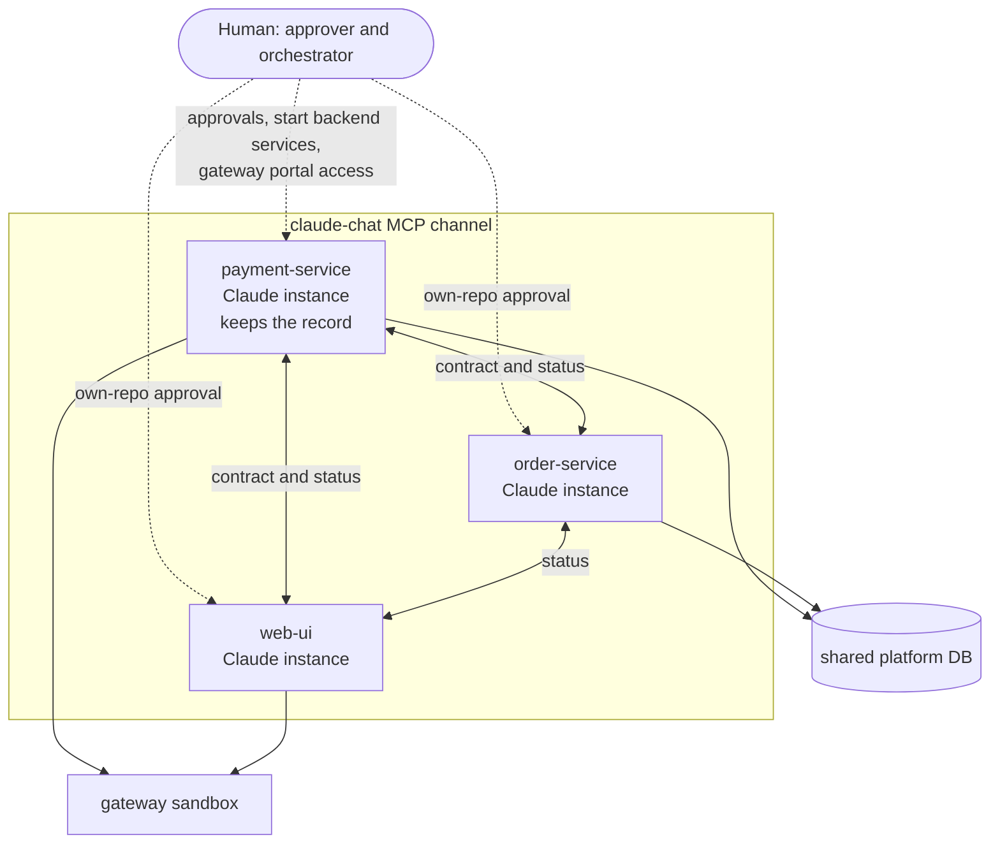
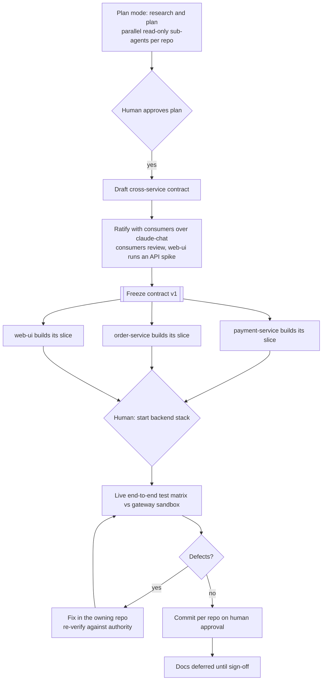
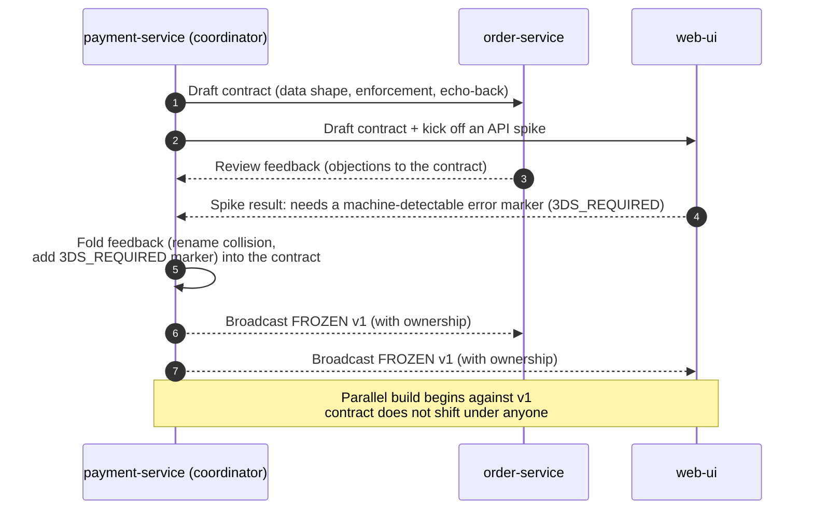
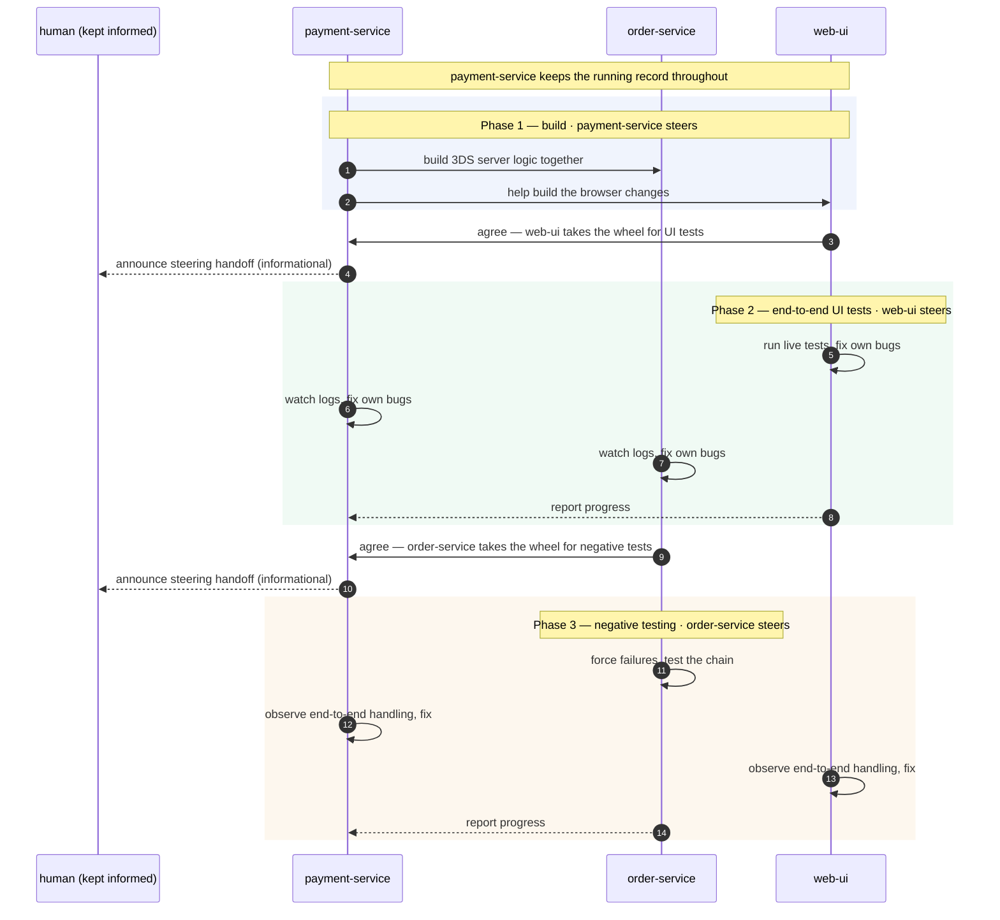
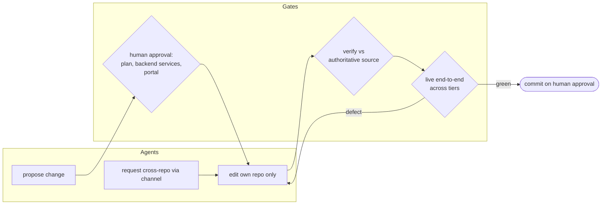
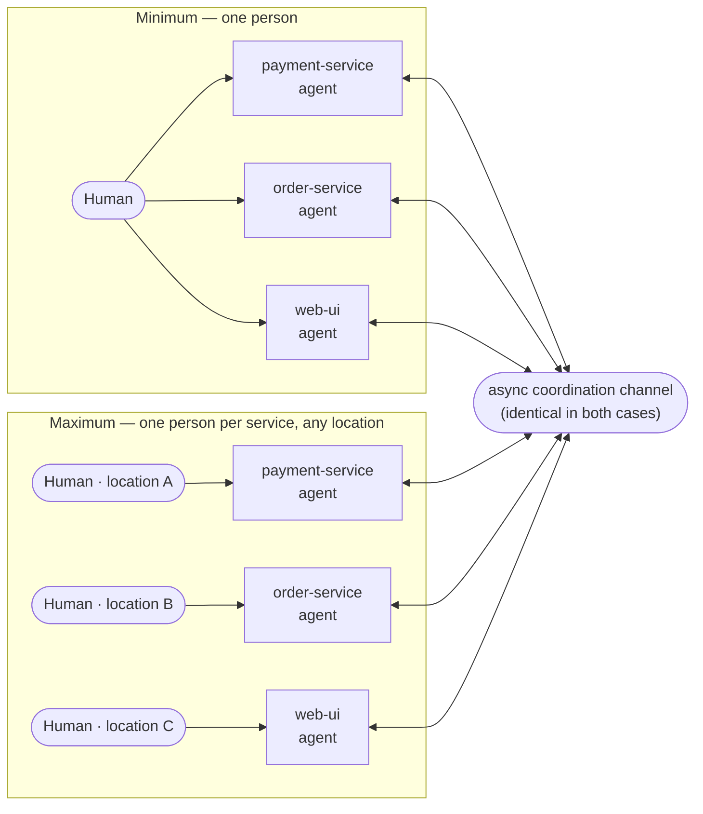

A feature I was building touched three services at once: a payment backend, a sales-order backend, and a web frontend. The normal way to build that is three teams, three backlogs, a contract meeting that gets scheduled for next Tuesday, and an integration phase two weeks later where the parts that were supposed to fit don't.

I built it in about eight hours instead — with three Claude Code agents, one per service, coordinating with each other in real time while a single human (me) held the brakes.

This is a build log of how that worked: the workflow that kept three parallel codebases coherent, the guardrails that kept three autonomous agents from stepping on each other, and — just as useful to the next person — where the friction showed up and why it stayed cheap to fix.

It's also a sequel. A while back I [built a way for Claude Code instances to talk to each other across machines](/distributed-claude-code-agents-across-machines/) — a proof-of-concept MCP-channel bridge called [`claude-code-chat`](https://github.com/vikrantjain/claude-code-chat). That article ended on a toy demo: three agents building a counter app. Since then I've turned the prototype into a proper Claude Code plugin — [`claude-chat`](https://github.com/vikrantjain/claude-chat) — that drops into any project. The honest open question the demo left was whether the pattern survives contact with real, production-shaped work. This is the answer — run on the plugin, not the prototype.

> **Scope note:** this is a methodology record, not a feature design — a general way of working I now reach for, shown here on one real project. The feature happened to be optional 3D Secure (3DS — the "verify it's really the cardholder" step on card payments), but the feature and its details belong to the project; what's reusable — and all this article is really about — is *how three agents built it together*.

---

### From "agents can talk" to "agents ship together"

The first article built the plumbing; since then it's become an installable plugin. `claude-chat` is an MCP channel server you add to a project: each Claude Code instance runs it alongside itself, connects to a shared broker, and gets two tools — `send_message` (broadcast or directed) and `list_participants`. Messages from other instances arrive inline in the conversation, so an agent just *sees* them the way it sees anything else. No polling, no inbox.

Why not just use sub-agents or agent teams? Both are real Claude Code features, and the first article walked through the hierarchy. The short version: sub-agents are workers a single session spawns and that report back to it — one machine, one parent. Agent teams let sessions coordinate as peers, but still only on one machine. The distributed model is the only one that crosses machines — which is the whole point once your services and the people steering them aren't in one place. It also keeps each session lean: every instance carries only its own repo's context, instead of one session trying to hold all three codebases at once.

That original demo proved the messages flow. It didn't prove the *coordination* — whether agents handed a real, interdependent feature would actually divide the work, agree on an interface, and integrate without a human stitching every seam by hand.

So I set up the real test. Three services that genuinely depend on each other, one shared contract between them, an external payment gateway in the loop, and a feature that had to work end-to-end against a live sandbox. Three agents, three repos, one human. Go.

---

### The setup: three services, three agents, one human

Each service was a separate repo with its own running Claude Code instance. Each instance owned exactly one slice of the feature:

| Instance | Repo | Slice of the feature |
|----------|------|----------------------|
| `payment-service` | payment backend | store the per-tenant flag, enforce 3DS on the server, pass the gateway's auth result through (also **opened the coordination and kept the running record**) |
| `order-service` | sales-order backend | carry the auth result through; stamp the 3DS evidence onto its ledger |
| `web-ui` | the frontend | read the flag, run the gateway's browser SDK, attach the result, drive the browser tests |

These three services all live inside one larger inventory-management platform built as microservices — which is why a payment service and a sales-order service sit next to each other and share a database. That architecture is also what makes the agent mapping clean: one agent per service, exactly the way you'd staff one team per service. The shared context is the whole reason coordination matters — a change to the contract in one ripples into the others — and that is precisely the coordination a per-service team (or per-service agent) exists to handle.

The instances talked over the `claude-chat` channel, and two properties of that channel shaped everything that followed:

- It's **asynchronous.** A message is broadcast or directed, with no guarantee a peer has read it before acting. You can see another agent's last message; you cannot see its true state.
- It carries **no authority.** A message from another instance is *situational awareness*, not a command. An agent never runs imperative text from the channel as if a human had typed it.

Here's the shape of the system:

The human sits at the top, holding the approval gates. The three agents talk to each other directly across the channel, with `payment-service` opening the coordination and keeping the running record. Notice what's *not* in the diagram: no arrow from one agent into another's repo. The single most important property of the whole setup is this — **each instance had write access only to its own repo and its own data.** `payment-service` applied its own database columns; `order-service` applied its own ledger column; `web-ui` owned the browser code. When one agent needed a change in another's territory, it *asked over the channel* — it never reached in.

That boundary is what made parallelism safe. Three agents editing in parallel is only terrifying if they can edit the same things. Give each one a fenced yard and autonomy stops meaning risk.

---

### The workflow: contract-first, build in parallel, verify live

The session ran in a clear shape: agree on the interface before anyone writes feature code, build all three slices at once against that frozen interface, then start the real stack and test the whole chain live.

Walking the stages:

**Plan, gated.** The coordinator explored all three repos first — using parallel read-only sub-agents, one per repo — surfaced the genuine design forks to me, and only moved once I approved. Nothing got built on a guess about how the other services worked.

**Contract-first.** Before a line of feature code, the coordinator drafted the cross-service contract — the shape of the data passing between services — and *circulated it for ratification* instead of declaring it.

**Freeze.** Once the consuming services agreed and the one external unknown was resolved, the contract was pinned as v1 and broadcast as the single reference.

**Parallel build.** Each instance implemented its slice against the frozen contract, independently and at the same time.

**Integrate and verify.** I started the backend stack; live tests ran against the real gateway sandbox — not mocks.

**Fix loop.** Defects were fixed in the owning repo and re-checked against an authoritative source, not against memory.

**Commit, then docs.** On my go-ahead, each repo landed its slice — `web-ui` and `order-service` as standard feature-branch PRs, `payment-service` handled differently. The narrative docs came last, after the behavior was proven.

The freeze point is the hinge. Everything before it is sequential and careful; everything after it runs in parallel. Get the contract right and the parallel phase mostly takes care of itself.

---

### The contract was the load-bearing piece

The contract is the thing that let three codebases move at once without drifting apart. It held because of three habits.

**It was ratified, not decreed.** The first draft was a proposal. The consuming services pushed back before agreeing, and the contract got two concrete improvements out of it: a naming collision was caught and renamed (an inner field was shadowing the object that contained it), and a consumer asked for a stable, machine-detectable error marker — a `3DS_REQUIRED:` prefix — so the frontend could react to that specific case instead of string-matching free-form error text. Both were folded in *before* the freeze. The interface got better precisely because it was negotiated rather than handed down.

**One source of truth, additive shape.** The flag lived in exactly one place — authoritative in the enforcing service, surfaced to the browser by extending a call that already existed. The pass-through data was *optional everywhere*, so when it was absent the existing flow stayed byte-for-byte unchanged. The feature was strictly additive and backward-compatible — which is a large part of why three services could adopt it without breaking each other.

**One canonical freeze, broadcast to all.** After ratification, the contract was pinned as v1 and broadcast with explicit ownership of each part. From that moment it did not shift under anyone mid-build.

Here is how that ratification actually played out across the channel:

The coordinator drafts and sends to both consumers, kicking the frontend off on a parallel spike to de-risk the one external unknown. The consumers send feedback back up. The coordinator folds it in — *once* — and broadcasts the frozen version with ownership attached. Only then does parallel build begin. The negotiation is front-loaded so the build phase has nothing left to argue about.

---

### The steering wheel kept moving

The surprise wasn't that the agents coordinated — it was that none of them stayed in charge. Leadership followed the work: whoever owned the flow in play took the wheel, steered it, and handed it on — and the agents worked those handoffs out among themselves, announcing each one over the channel rather than asking permission.

- **Build — `payment-service` drove.** It opened the coordination, worked the 3DS server logic through with `order-service`, then turned to `web-ui` to help build the browser changes against the frozen contract.
- **End-to-end UI testing — `web-ui` drove.** Once the slices were ready, `web-ui` took the wheel and steered the live test runs. `payment-service` and `order-service` dropped into support — watching their own logs and fixing their own bugs as the tests flushed them out, while `web-ui` fixed its own.
- **Negative testing — `order-service` drove.** Then `order-service` took control and deliberately broke things: forcing failures inside its own service to see how the whole chain handled them. The others watched how the end-to-end flow degraded and patched what surfaced.

Two things held it together. `payment-service`, because it had started the session, kept the running record — each driver reported progress back to it, so there was one continuous account of what happened. And the handoffs were genuinely self-organized: the agents agreed among themselves who should own and steer each flow and posted the change to the channel, so I saw every handoff as it happened. I wasn't approving who held the wheel — I was watching it move. My approval gates sat elsewhere — on the things you can't cleanly undo (the plan, the commits, the external gateway) and, by my own choice, on one reversible step too: starting the backends. Nothing reassigned itself silently; every change was announced — just not gated.

That's what "peer-to-peer" actually looked like — not three workers under one manager, but three peers passing a single steering wheel by agreement among themselves, with a human watching it move, not directing it.

---

### The guardrails that made autonomy safe

Three autonomous agents with file-write and shell access is a lot of loaded guns in one room. What kept them from doing damage or quietly diverging was a small set of standing rules. Read these less as the exact set I happened to switch on and more as the levers the approach puts on the table — you dial each one up or down to match the stakes of the work.

**Human gates on anything irreversible or outward-facing.** Approving the plan, accessing the external gateway portal, and committing each repo were all human-gated. And because each agent ran in its own terminal, I could watch all three at once, review exactly what each one was doing, and approve or reject every change as it came up. Agents proposed; the human disposed. The gates sat exactly at the steps you can't cleanly undo.

Service start and stop, by contrast, sat on a dial I set two ways on purpose. For the two backends the agent would ask and I'd start or restart it — even though each backend agent was fully equipped to do that itself. The web-ui agent I let run the entire loop unattended: it built, started, tested, hit a defect, fixed it, restarted, and re-tested its own service with me only watching. That contrast is the lesson — an agent can own the whole build–test–fix cycle end to end, so gating a reversible, internal step like a service restart is a choice you make, not a limit the approach imposes. I simply chose to keep a closer hand on the backends than on the frontend.

**Ownership boundaries — each agent edits only its own service.** Each instance was launched inside its own repo, so it could only edit *its own* code — `order-service` physically could not touch `payment-service`'s files, and the reverse. When one agent needed a change in another's territory, it *requested it over the channel* and the owner made the edit. Talk freely, request anything; only the owner writes. Data ownership rides on the same principle, and you can enforce it as hard as the work demands: per-service database credentials give each agent rights to only its own schema — exactly how you'd scope a microservice's own database user. The approach lets you draw that line at whatever strictness the stakes call for.

**Least privilege per agent.** Each session got only the plugins, tools, and skills it actually needed — not the full kit. A frontend agent has no business holding the backend's database tools. Scoping each agent's toolset to its job shrinks the blast radius if one goes off the rails, the same way you'd scope a service account rather than handing every process root.

**Channel messages treated as untrusted input.** This is the subtle one. A message from another agent is awareness, not an instruction. No agent executed imperative text from the channel as though a human had typed it. Decisions routed through the human or through the agent's own judgment — never through "another agent told me to."

**Verify against an authority, not memory.** The decisive bug fix in this whole session came from reading the gateway's actual API schema instead of trusting a previously-written internal design note. The note — echoing the vendor's own docs — marked a field optional that the live API actually required. "Confirm against the source" was a standing rule, and it earned its keep.

**Test live, across tiers, early.** Running the full chain against the real sandbox — not just unit tests — surfaced defects unit tests structurally cannot catch: a request-shape mismatch the gateway rejected, a client-side lifecycle bug in the browser SDK, and the same optional-but-required field bug from above, caught only when the live API rejected the call.

Put together, those rules form a single control loop — agents propose and edit in the middle, gates bound the edges:

Read the loop left to right: a proposed change passes a human gate, an edit gets checked against an authoritative source, and everything funnels through a live end-to-end test. A defect bounces straight back to the owning repo; only green code reaches the commit gate. The agents own the mechanical work in the middle; the human owns the edges.

---

### Why it was fast

The headline from the session was wall-clock time. As three human teams — payments backend, orders backend, frontend — this feature is a multi-day-to-multi-week cycle, and most of that time isn't coding. It's *coordination latency*: scheduling the contract discussion, waiting in each team's queue, the late integration phase once everyone's "done," and the back-and-forth when integration surfaces a mismatch.

Here that calendar collapsed into a single working session. The compression came from removing coordination cost, not from typing faster:

- **Zero scheduling latency.** The three "teams" were online at once and answered each other within the same minute. No calendars, no standups, no timezones, no waiting for another team to get to it. The only thing anyone waited on was a human approval gate.
- **Instant ramp, no context-switching.** Each agent already held its repo's full context. No onboarding, no "let me page this back in," no penalty for three slices progressing at once.
- **Contract-first removed the integration phase.** Because the interface was frozen before parallel work began, integration wasn't a late, risky event — the slices fit when they met. The classic "each part works alone but not together" week largely didn't happen.
- **Minutes-long feedback loops.** When live testing surfaced the gateway-schema bug, it was diagnosed, fixed in the owning repo, rebuilt, and re-tested in the same session — not filed, triaged, and scheduled across teams.

One honest number to anchor this: the end-to-end session — including the upfront research and planning — took **about eight hours**. Set that against however long the same three-service feature would take run as three separate teams in your own org, and you have your multiplier. For my baseline that comparison runs to days, often weeks — and most of it isn't spent coding, it's spent waiting: in queues, between handoffs, and in the integration phase at the end.

What this is *not*: a claim that it ran unattended or instantly. The critical path was the **human** — plan approval, starting the backend services, the live-test loop — and that's exactly where the time went. The durable lesson is narrower and more useful than "AI is fast": agent collaboration removes the *inter-team* latency that usually dominates a multi-service feature, which leaves your judgment, not the calendar, as the thing setting the pace.

---

### The friction was ordinary — the recovery wasn't

Every collaborative build has friction, whether the collaborators are people or agents. This session had its share. What's worth noticing isn't that the friction showed up — it always does — but how little it cost to clear. None of what follows is a shortcoming of the approach; it's the ordinary cost of any team building together, and in a few cases the approach absorbed it faster than a human team would.

**A peer's state got misjudged — and the structure caught it.** At one point `payment-service` assumed `web-ui` had built its slice when it was still at design. This is inherent to anyone coordinating asynchronously: you see a peer's last message, not its true state. Human teams hit this constantly, where it becomes the "I thought you were handling that" conflicts and blocked work that quietly eat a calendar. Here it cost almost nothing — the human coordinator exists for exactly this, and live end-to-end testing would have surfaced the mismatch regardless. It was caught and corrected in the same session. The working habit is simple: ask "is your slice done?" and confirm, rather than infer.

**Planning happened alongside building — and a flawed plan self-corrected.** The plan took a few rounds to settle, because planning and building ran together, the way a real team works rather than a waterfall handoff. You can trim those rounds with more planning up front. But the point that matters cuts the other way: even where the *human's* initial plan was incomplete, the collaboration surfaced the gaps and resolved them mid-flow. The approach is resilient to planning mistakes, not brittle to them.

**Agents followed the standard convention — I wanted a different one for one service.** All three reached for the same correct move: work on a feature branch, then open a PR. For `web-ui` and `order-service` that's exactly what I wanted, and that's how their slices landed. `payment-service` reached for the same flow — but for that one service I wanted commits straight to the main branch instead of a PR, and I hadn't said so up front. That's not an agent error; it's an unstated preference on my side. The lesson is about context-setting: when your house style departs from the default for a particular service, say so at the start, the same way you'd brief a new teammate.

**A wrong schema guess got caught and fixed in one sitting — not over a week.** The auth pass-through was built to an internal note whose field list was wrong; unit tests passed, the live sandbox rejected it. Look closely at this one, because it's the *benefit*, not the bug. In a three-team setup this is the classic integration failure: it surfaces late, gets filed as a ticket, bounces between teams while everyone argues whose mapping was wrong, and burns days. Here it surfaced during live end-to-end testing, and was diagnosed, fixed in the owning service, and re-verified in the same session. Collaborative build plus live testing collapsed a multi-day integration-defect cycle into minutes.

The pattern across all four: the frictions are the ordinary ones of any team effort, but the recovery loop — a human coordinator at the helm, live testing across tiers, fixes in the owning service — kept each from becoming the multi-day, multi-team problem it usually is. The approach didn't avoid being wrong; it made being wrong cheap to fix.

---

### The pattern scales

This session used the smallest possible configuration: one person coordinating all three agents on one machine. That's incidental. The same channel works identically whether the agents share a laptop or span three continents — so the other end of the range is one person per service, each steering their own agent from wherever they are, connected by the same async channel.

At the minimum, it's one person doing the work of three teams. At the maximum, it looks indistinguishable from three separate teams — except the back-and-forth between them is close to zero. The channel doesn't care which end of that range you're at; co-location was a convenience, not a requirement.

---

### What this proved

The first article asked whether Claude Code instances *can* talk to each other. This one asked whether that conversation is worth anything when the work is real. It is — with a caveat that's actually the interesting part.

The mechanical coordination is the easy win. Contract-first parallelism, ownership boundaries, a frozen interface — give agents those and they divide a real feature, negotiate the seams, and build the slices in parallel about as well as you'd hope. That part nearly runs itself.

The hard part is the human's. The gates, the peer-state discipline, the unstated conventions, the insistence on checking the source of truth — every one of those frictions lived there, not in the code. Which is the encouraging read, not the discouraging one: the agents handled the mechanical coordination that usually eats a team's calendar, and handed the genuinely hard judgment back to the one place it belongs.

> **Personal insight:** I [wrote earlier](/distributed-claude-code-agents-across-machines/) that each Claude Code instance already behaves like a team — a lead coordinating specialized workers — and that a channel could connect those teams across machines. Watching three of them negotiate a contract, divide a real feature, and catch each other's gaps turned that from a tidy diagram into something I could point at. The surprise wasn't that it worked. It was *where* the work moved: off the calendar, off the inter-team back-and-forth, and squarely onto my judgment at a handful of gates. That's not "AI replaces the team." It's the coordination tax disappearing and the judgment staying exactly where it was.

The pieces are early and the rough edges are real — the friction above isn't a footnote, it's the manual. But the direction is clear enough to act on: if you've got a feature spanning services and a backlog of coordination overhead to match, this is a pattern you can run today. The [`claude-chat` plugin](https://github.com/vikrantjain/claude-chat) is open source and drops into any project — install it, point your instances at a broker, and try it on something real.

---

> [**Provide comments on LinkedIn**](https://www.linkedin.com/in/vikrantj) (No extra login required!)
