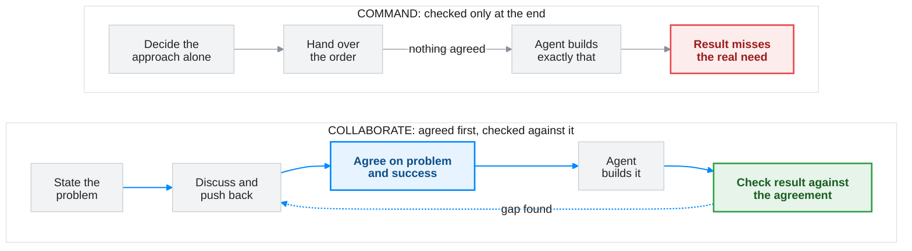

Here are three requests I've seen at work.

A product manager gave the dev team a requirements doc. Every department would get its own AI agent. The agents would talk to other agents, inside and outside the company, over A2A, a protocol for agents to talk to each other. That way they would get answers to all kinds of problems quickly. The reasons given were speed to market, and that competitors were building AI agents.

An architect asked an AI agent to write an architecture doc. All of the organisation's docs would move into a vector store, a database built for AI search. MCP servers would sit on top of it. MCP is a standard way for AI agents to call tools. Customers' AI agents would use those tools to get answers from the docs.

A developer asked an AI agent to build a todos app in Java. The todos would be stored in DynamoDB, Amazon's database, *"for fast and scalable retrieval"*. Notifications would go through SNS, Amazon's messaging service.

Three roles, one shape. Each request names a solution. None of them says what problem the solution solves, or for whom. **Each one is an order.**

---

### What happened next

The dev teams spent a lot of time and money building whatever agents they could, and learning A2A. Most of it produced no real outcome. Where there was one, nobody could see it, because nobody could say which business problem it solved. So nobody was waiting for it. Nobody called it a failure either. Slowly, the project was accepted as a long-term goal, one the company would reach one day.

The architect's agent produced the design in a day. The trouble started when the team built it with real data. That took a long time. Every update to the docs needed extra work to keep the vector store in step, and the team wrote utility scripts to manage it. The service did ship. It was offered to customers free, because the product docs were already free for anyone to read. Its total cost, maintenance included, was high for a service offered free.

I ran the todos request again myself, and I'll come back to it.

Neither story is about bad people. The teams worked hard, and the agent was quick. Everyone did what they were asked. The problem sits one step earlier, in how the work was handed over.

---

### One mind, or many

When one person decides the approach and everyone else executes, the result can't be better than that person's thinking. Ten people carrying out one plan are still limited by the plan. Nobody else's knowledge gets a chance to change it.

When a team works the problem out together, people raise issues, question each other and reach decisions they all accept. The result can draw on everything the team knows. Sometimes it goes further, because one person's idea sets off a better one in someone else.

Collaboration doesn't guarantee a better result. **It removes the ceiling that command puts in place.**

The ceiling is hard to see because the failure is slow. The product manager's project never had a day when it visibly failed. It drifted, and the drift got a new name. When the cost of a decision shows up months later, people blame whatever is nearest: the technology, the estimates, a tough domain. The order that started it rarely gets questioned. By then it no longer looks like a choice.

---

### A faster agent doesn't fix it

It's tempting to think AI changes this. An agent turns an order into finished work in minutes, so a wrong order should show itself sooner.

I gave the todos request, word for word, to Claude Opus. In under three minutes it had written ten files: the Java code, the build setup, a local test environment and a README. It asked no questions. It never asked what the app was for, who would use it, or whether DynamoDB and SNS were the right fit. It filled those gaps itself. It decided the app had many users, and organised every todo by user. It added no login. Its closing summary pointed out that anyone who could reach the app could read or change anyone's todos. It also warned that notifications could be lost without anyone knowing.

That summary is the useful part. Within minutes, the agent showed every decision it had made on the developer's behalf. It only helps if someone reads those decisions against a stated problem. Without one, there's nothing to check them against, and the build looks finished.

The architect's story shows what happens next. The design took a day. Nothing in it was checked against a problem, because nobody had stated one. The cost arrived where it always had: in the building and maintenance that followed.

**A fast agent removes the delay between an order and a finished result. It doesn't remove the delay between an order and its consequences.** More gets built before anyone asks why.

The two styles run through different loops. The diagram shows where each one finds out it went wrong.

**Command** runs in a straight line. The only check is the finished result, so a wrong approach is found at the end, when it costs the most. An agent gets you to that end sooner, but it's still the end.

**Collaborate** puts the thinking before the building. The problem and the meaning of success are agreed first, by both sides. The result is then checked against that agreement, not against whatever the person giving the orders had in mind. When the check finds a gap, the loop goes back to discussion, not to a fresh order.

---

### What a peer does instead

The alternative isn't a longer order. It's giving whoever does the work room to question the order before it starts.

Take the product manager's requirement. If they had brought it to the team as a problem to discuss, the real need had a good chance of surfacing. Maybe the real goal was simply to start building AI agents. Even then, a discussion could have agreed what outcome to expect from them, and people would have known what they were waiting for. Simpler options than agents talking over A2A might have come up too. In a field changing this fast, one protocol shouldn't be a fixed requirement. It's a preference presented as a constraint.

An agent can open that discussion too. I gave the same requirement to an agent and asked it to review the brief. It said the brief handed over the answer but not the problem it was meant to solve. Its first questions were what is slow today, and who feels that delay.

I did the same with the architect's request, which had gone to an agent the first time. This time I asked the agent to review how the work was briefed before doing anything. It wrote no design. It opened like this:

> You've given me the whole architecture already: a vector store, MCP servers on top of it, and MCP tools for customers. The only goal is "their AI agents can get answers from our docs easily." So the doc I'd write would describe a design that's already been chosen. It wouldn't test that design.

Its first question was what was going wrong today. Were customers' agents giving wrong answers about the product? Were customers asking for this? Was it a support cost, or a competitive move? It also asked whether MCP was a requirement or a first idea. If it was a first idea, the agent wanted room to compare it with simpler options, such as a public docs API.

I can't know whether those questions would have changed the design. The agent didn't know the docs were already free to read. But nobody asked those questions at the time, and each one points at something the project later paid for.

A peer is also useful when you have thought it through. In one of my test scenarios, a members' association wants a survey: every member rates each of its six events from 1 to 5. The events committee's minutes explain why. The venue budget has been halved, and the committee must pick three events to keep. The minutes also note that attendance alone won't settle it, because some events draw the same small group every year.

Asked to review the survey brief, the agent found the minutes and credited that reasoning. Then it pointed out a gap. A rating from 1 to 5 measures enthusiasm, and regulars will rate their own events highly. That's roughly the same signal as attendance, which the minutes had said wasn't enough. It suggested one extra question: which events has each member attended, or would attend? The answers show how many different members each event reaches, which is what the committee cared about. It kept the 1-to-5 scale, so the results could still be compared with the last survey.

The committee's plan wasn't wrong. It had a ceiling, and a second mind lifted it.

---

### Before your next task

Working with an agent as a peer comes down to how you open a task:

- **State the problem, not only the solution.** "Fewer members come to our events, and we don't know why" gives the agent something to think about. "Send a survey" gives it only something to do.
- **Separate real constraints from preferences.** A deadline, a regulation or a system that can't change is a constraint. Your favourite tool is a preference. A preference presented as a constraint quietly removes every option that conflicts with it.
- **Say what success looks like.** If nobody but you can tell whether the result is right, the agent can't either.
- **Leave room to disagree.** Sometimes you've decided, and you want execution. That's fine. Say so, and say why. The costly version is the accidental one, where you'd have welcomed a better idea and never gave the agent a chance to offer it.

Next time you open a session with an agent, read your first message back before you send it. Ask whether it describes a problem or gives an order. If it gives an order, ask whether you meant to.

I expect this to matter more with each new model. The more capable the agent, the more a command-style brief wastes it. You end up with a strong colleague carrying out a weak plan very well, and very fast.

---

### The tool I use to catch myself

Seeing your own style is the hard part. A first idea and a considered decision look the same on the page, and the reasoning always feels complete from the inside. So I built [**`intent`**](https://github.com/vikrantjain/intent), a small Claude Code plugin. Its review skill produced both reviews above. It reads how you briefed the agent, not what you asked for, and it runs only when you ask. A second skill writes the problem you agreed on into a short `intent.md`. Neither assumes the work is code.

The plugin is an early experiment, and I expect it to improve with use. Issues and suggestions on the repo are welcome.

> The command habit is one of several I see in how people work with AI. Two others deserve their own articles: treating the agent as an oracle that should know what it was never told, and believing that only specially trained people can use AI well. More on those soon.
