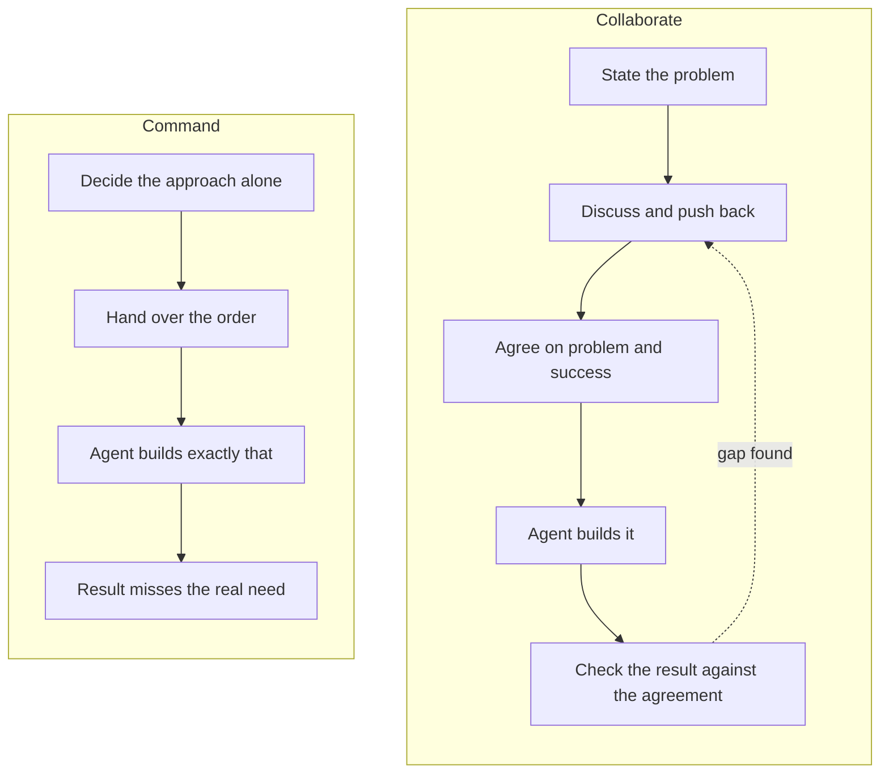

Type this into a coding agent: *"Use Postgres for our event data and set up the schema."*

A minute later you have a migration file. The events table is split by month. There are indexes for lookups by type, by actor and by time. There is a JSON column for fields that vary between event types. At the bottom sits a section called **"Assumptions I made"**. The first assumption reads: *"General app or product events, one row each, never updated."*

That section is the whole story. Each assumption is a decision about your system that you never knew you had handed over. The agent didn't know what the events were. It didn't know who would read them, or how. It didn't know whether Postgres was a hard requirement or just the first thing you thought of. You gave it an order, so it filled the gaps itself and delivered.

When the result turns out wrong, the usual verdict is that the agent isn't capable enough, or that the problem was too hard. I think the cause sits one step earlier, in how we work with the agent.

---

### One mind, or many

Think about two ways a team can work.

In the first, one person decides. They pick the approach, break it into instructions and hand those out. Everyone else executes. However large that team is, its result can't be better than the thinking of the person giving the orders. Ten people carrying out one person's plan are still limited by that one plan.

In the second, the team works things out together. People raise problems, question each other, give feedback and reach decisions they all accept. The result is no longer limited by any one member. It can reach what the whole team knows, and sometimes more, because one person's idea sets off a better one in someone else.

Collaboration doesn't guarantee a better result. **It removes the ceiling that command puts in place.**

This isn't about being nice. It's about what the working style allows the team to know.

---

### Software paid for this for years, and rarely noticed

Software projects have failed for many reasons. The command style is one of the biggest, and one of the least visible. I've seen it while working with people across industries and at every level of seniority.

The failure is slow. A requirement arrives already shaped as a solution: *"add a nightly cron job"*, *"use this framework"*, *"build a screen for X"*. The team builds exactly that. Weeks or months later, the result reaches real users and misses what they needed. By then the cause is hard to trace. The postmortem finds scope creep, unclear requirements, bad estimates or a tough domain. It rarely finds that one person decided the approach and nobody was invited to question it.

That delay hid the pattern. When a failure shows up months after its cause, people blame whatever is nearest in time.

---

### AI removes the delay

A coding agent doesn't need weeks. It turns an order into finished work within minutes.

That changes what we can see. If you brief an agent the way a commander briefs a team, the agent will usually do what it was told, however poor the plan. It won't sulk or slow down. It won't quietly do something else. It will build the Postgres schema, draft the survey or write the cron job, and fill every gap with its own guess. The ceiling that took months to show up in a human team now shows up before your coffee gets cold.

Most people read that as the agent's limitation. I read it as a mirror. The agent is showing us, fast and cheaply, a habit we have always had.

The good news points the same way. If the command style's ceiling shows up this quickly, so does the payoff of collaborating.

The two styles run through different loops. The diagram shows where each one finds out it went wrong.



**Command** runs in a straight line. The only check is the finished result, so a wrong approach is found at the end, when it costs the most. With a human team, that end could be months away. With an agent, it's minutes away, but it's still the end.

**Collaborate** puts the thinking before the building. The problem and the meaning of success are agreed first, by both sides. The result is then checked against that agreement, not against whatever the person giving the orders had in mind. When the check finds a gap, the loop goes back to discussion, not to a fresh order.

---

### What collaborating with an agent looks like

Here is the same Postgres request again, same model. This time the agent was set up to respond to *how* the work was briefed. It wrote no schema. It opened like this:

> You've given me the tool (Postgres) and the task (a schema), but not what the event data is or what it's for. So the brief leaves me no point where I could suggest a different approach, and nothing to check a schema against. [...] Tell me the problem and how the data will be used, and I can design for that. [...] Postgres may well be the right choice. If it's already settled, tell me why, because the reason affects how I set up the rest.

Then it asked four questions: what the events are and where they come from, who reads the data and how, whether Postgres is a hard requirement, and how you'll know the schema is right.

Nothing in that reply is clever. It's what a good senior colleague would say in a design discussion. It also opens the thing the first reply shut. The agent can now propose something better, or confirm your choice for a reason you both understand.

Working with an agent as a peer comes down to a few shifts in how you open a task:

- **State the problem, not only the solution.** "Members are leaving in their first year and nobody knows why" gives the agent something to think about. "Send a survey" gives it only something to do.
- **Separate real constraints from preferences.** A deadline, a regulation or a system that can't change is a constraint. Your favourite tool is a preference. When a preference is presented as a constraint, every option that conflicts with it quietly disappears.
- **Say what success looks like.** "Make it faster" leaves the standard in your head. If nobody but you can tell whether the result is right, the agent can't either.
- **Leave room for the agent to disagree.** Sometimes you've decided, and you want execution. That's fine. Say so, and say why. The problem is the accidental version, where you would have welcomed a better idea and never gave the agent a chance to offer one.

There's a benefit beyond the result. When you discuss a problem with an agent, you learn from it. It knows approaches and trade-offs you haven't met, and it will explain them if you ask. It learns from you what matters in your situation, which no model can know in advance. Each side's mistakes get caught earlier. That exchange is what you give up when you only give orders.

---

### The hard part: seeing your own style

All of this sounds obvious written down. It's much harder to spot in the moment.

A request that dictates a solution and a request that states a considered decision look the same on the page. "Use Postgres" might be a first idea. It might also be a choice you made last month for good reasons. You're usually the last person to notice which one it is, because the reasoning feels complete from the inside.

So I built a small Claude Code plugin to point it out. It's called [**`intent`**](https://github.com/vikrantjain/intent), and it has two skills.

**`/intent:briefing-review`** reviews how you briefed the agent, not what you asked for. It doesn't judge your plan. It checks whether you stated a problem or only an approach, and whether your constraints are real or preferences. It checks whether success is defined, and whether you left the agent any room to propose something different. Then it tells you plainly and politely what a different brief would get you, and asks what it needs to reach your actual goal. The Postgres reply above came from this skill. If you tell it you've already thought it through, it takes you at your word and moves on.

**`/intent:capture`** writes down what you and the agent agreed. It produces a short `intent.md` with the same six sections every time: the problem, why it matters, what success means, real constraints, what's out of scope and what's still open. It captures *what* and *why*, never *how*. It's about 400 words, readable in two minutes. Later work can be checked against it. If you later try to change the problem or the success criteria, it tells you what that change affects and waits for you to agree.

Here is one it wrote during the plugin's tests. The request described a food bank whose Saturday volunteer shifts keep ending up short-staffed. It gave the cost, a target and a budget limit, and said recruiting was a separate effort. `capture` turned that into this:

```markdown
# Intent: Reliable Saturday shift staffing

## Problem
About a third of Saturday shifts at the food bank end up short-staffed. Volunteers sign up through
a shared spreadsheet, then forget or drop out without telling anyone. Nobody finds out about the
gaps until late, and the volunteer coordinator spends Friday evenings phoning around to fill them.

## Why it matters
Saturday is the busiest day. When a shift is short, the food bank serves fewer families. The
Friday calls also fall on one person, and the coordinator is close to quitting. If nothing
changes, the food bank risks losing the coordinator as well as the Saturday capacity.

## Success
- Saturday shifts are fully staffed at least 90% of the time, up from roughly 67% today.
- The coordinator spends under 30 minutes on Friday calls to fill gaps.

## Constraints
- No budget for paid software this year.

## Out of scope
- Recruiting new volunteers. That is a separate effort. This work is about getting the people
  who already signed up to turn up, or finding out early enough when they won't.

## Open questions
- What counts as "fully staffed": a set headcount per shift, or specific roles filled? (Coordinator)
- Over what period, and from what record, is the 90% measured? Today's one-third figure is an
  estimate, so a baseline may need to be recorded first. (Coordinator)
- Does the shared spreadsheet have to stay as the sign-up method, or could it change?
  (Coordinator / food bank leadership)
- Weekday shifts aren't mentioned. Do they have the same problem, and should they be covered?
  (Coordinator)
```

Notice what's missing. There's no reminder app, no text-message system and no new sign-up tool. Those are solutions, and choosing one is the next conversation. Notice also the open questions. The agent didn't guess what "fully staffed" means or where the 90% comes from. It wrote those down as things to settle, each with the person who can settle it.

Neither skill assumes software. One of the plugin's test cases is a request to *"send a survey to all our members asking them to rate our events from 1 to 5, and have it out by next week."* The review points out that the request says what to build but not what you want to find out. It notes that a single number shows *that* people are unhappy but not *why*. Then it asks what prompted the survey, what you'll decide from the results and where "next week" comes from. The same habit shows up in a food bank, a hiring decision or a research project, and the same questions help.

The plugin doesn't change how you work. It shows you which style your request is in, and what the other style would get you. The change is still yours to make.

---

### Before your next task

Next time you open a session with an agent, read your first message back before you send it. Ask yourself whether it describes a problem or gives an order. If it gives an order, ask whether you meant to.

If you meant to, fine. Add one sentence saying why. If you didn't, add the problem, what success looks like and an invitation to push back. Then compare what comes back.

I expect this to matter more with each new model. The more capable the agent, the more a command-style brief wastes it. You end up with a strong colleague doing a weak plan very well.

> The command habit is one of several I see in how people work with AI. Two others deserve their own articles: treating the agent as an oracle that should know what it was never told, and believing that only specially trained people can use AI well. More on those soon.
